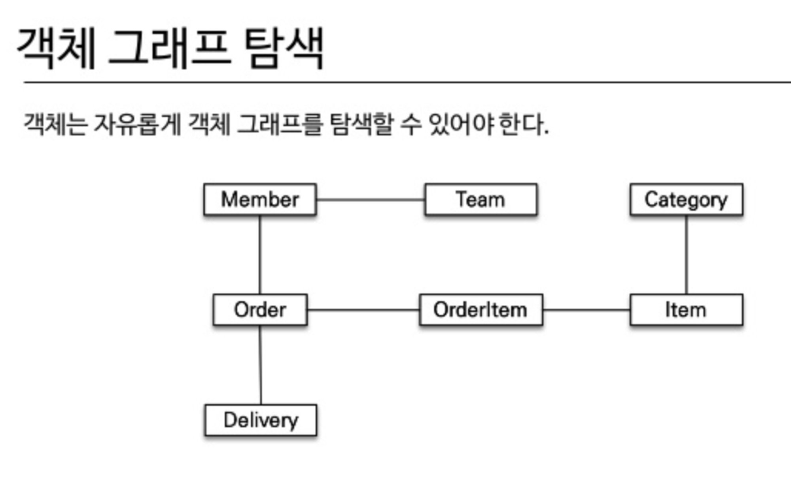

# Spring Data JPA의 Paging

### Page

Page가 반환타입인 경우, SELECT쿼리와 Count쿼리가  실행

```sql
select count(m1_0.member_id)
from member m1_0
where m1_0.age=10;
```

페이징 쿼리는 조건에 맞는 데이터 중에 offset과 limit에 해당하는 일부 데이터를 가져오는 쿼리 (ex.게시판)

조건에 맞는 총 데이터 중에 몇번째 페이지인지 몇 개의 데이터인지 파악하는 것이 중요 →  전체 데이터 개수도 알고 있어야 한다. 전체 데이터 개수를 알기 위해 카운트 쿼리가 추가로 실행

### Slice

전체 데이터는 중요하지 않음, 현재 페이지와 다음 페이지만 신경씀. (ex. 스크롤을 내리면 내릴수록 무한히 컨텐츠가 나오는 웹사이트)

slice는요청한 데이터 개수에서 하나의 데이터를 더 가져온다.  limit(size)+1 된 값을 가져옴

slice는 카운트쿼리가 나가지 않고 다음 slice가 존재하는지 여부만 확인할 수 있기때문에, 데이터 양이 많으면 많을수록 slice를 사용하는것이 성능상 유리하다.

### 결론

page는 게시판과 같이 총 데이터 갯수가 필요한 환경에서, slice는 모바일과 같이 총 데이터 갯수가 필요없는 환경에서(무한스크롤 등), 각각 필요한 용도에 알맞게 쓰면된다.

# 객체 그래프 탐색


- 객체는 자유롭게 그래프를 탐색 가능 각 상속, 연관 관계만 맺어져 있다면 멤버 -> 오더 -> 오더아이템 -> 아이템 -> 카테고리까지 접근 가능
- '.'을 찍어서 연관된 객체를 탐색하는 것을 객체 그래프 탐색이라 함
- 객체 그래프 탐색은 ORM(Object-Relational Mapping) 기술에서 주로 활용
- ORM은 객체와 데이터베이스 간의 매핑을 통해 객체 그래프를 데이터베이스 테이블들로 매핑
- 객체 그래프 탐색은 처음 실행하는 SQL 쿼리에 따라 객체 그래프 탐색의 범위가 결정
    - DB의 경우 ORM 설정에서 미리 정의된 그래프 범위에 따라 객체 그래프 탐색 이루어짐, 정해진 그래프 범위를 초과하여 객체 그래프를 탐색할 수 없으며, 데이터가 없는 경우에도 해당 객체에 대한 접근이 불가능

# JPQL (**객체지향 쿼리 언어)**

- JPA는 SQL을 추상화한 JPQL이라는 객체 지향 쿼리 언어를 제공 ⇒ 엔티티 객체를 대상으로 쿼리
- JPQL은 SQL을 추상화했기 때문에 특정 데이터베이스 SQL에 의존하지 않음.
- JPQL은 SQL과 문법이 유사하며, SELECT, FROM, WHERE, GROUP BY, HAVING, JOIN을 지원
- **JPQL은 결국 SQL로 변환됨.**

### JPQL의 장점

- **객체 지향적 접근**: 엔티티 객체와 그 관계를 기반으로 쿼리를 작성하여 객체 지향적 프로그래밍의 장점을 살릴 수 있음
- **데이터베이스 독립성**: 데이터베이스 종류나 구조의 변화에 상관없이 동일한 JPQL 쿼리를 사용할 수 있어 유지 보수와 확장성이 뛰어남
- **타입 안정성**: 컴파일 시점에 쿼리의 오타나 오류를 찾을 수 있어 안전성이 높음