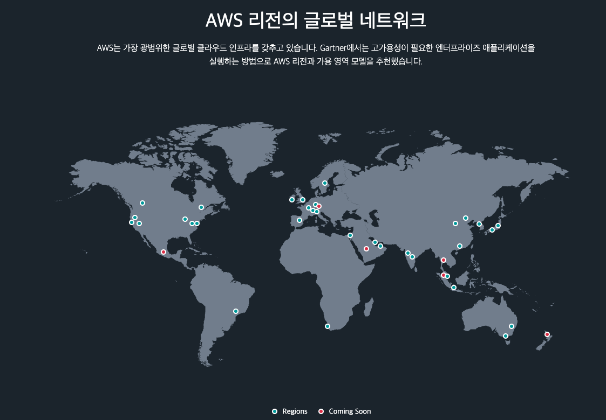
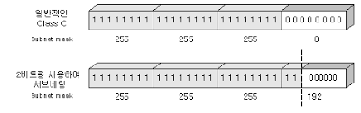
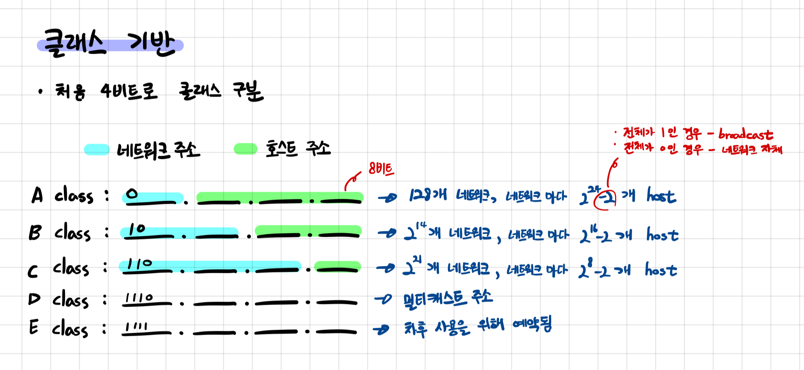
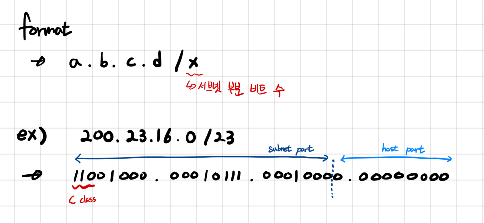

# Chapter 2. AWS (VPC & Internet Gateway & EC2)

> UMC 워크북 2주차 키워드에 관한 내용을 정리해보겠습니다 :)

# ✅ 학습 목표

1. AWS의 VPC를 이해한다.
2. 서버가 어떻게 구축되는지 이해한다.

# ✅ AWS

> AWS란 Amazon Web Services의 약자로, 전 세계에 200개가 넘는 데이터 센터를 구축하여 제공하고 있는 클라우드 서비스이다.

# ✅ 리전과 가용영역

 Amazon 클라우드 컴퓨팅 리소스는 세계 각지의 여러 곳에서 호스팅된다. 이러한 위치는 AWS 리전, 가용 영역 및 Local Zones로 구성된다. 각 AWS 리전은 개별 `지리 영역`이고, 각 AWS 리전은 `가용 영역`이라고 알려진 격리된 위치를 여러 개 가지고 있다.

 쉽게 말해 리전이 가장 큰 범위이며, 각 리전마다 1개 이상의 가용 영역을 가지고 있는 것이다. 하나의 리전에 여러 가용 영역이 존재하는 이유는 각 가용 영역이 위치한 데이터 센터가 물리적으로 떨어져 있기 때문에 자연재해나 정전, 테러와 같은 다양한 돌발상황에 대처하기 위함이다. (서울 리전은 4개의 가용 영역으로 구성되어 있다.)

## 가용영역 특징

- 완전히 격리된 하나 이상의 데이터 센터
- 충분한 물리적 거리 (100km 이내)
- 독립된 전력, 냉각, 물리적 보안
- 수십만 대 규모의 서버
- 높은 대역폭의 네트워크로 상호연결

# ✅ 서브네팅

## 서브넷

> 📋  하나의 IP 네트워크 주소를 네트워크 내부에서 적절히 분할하여 실제로는 여러 개의 서로 연결된 지역 네트워크로 사용하는 것이다.

## 서브넷팅 & 서브넷 마스크

> 📋  회사나 조직에 할당된 네트워크 ID의 IP 주소들을 가지고 내부적으로 여러 개의 서브넷을 만드는 과정이다. 이를 통해 IP 주소의 낭비를 방지할 수 있다.

- 위 그림처럼 일반적인 Class C 네트워크는 32비트 중 24비트를 네트워크 ID로 사용하며, 나머지 8비트로 호스트를 구분한다.

- 하지만 2비트를 추가로 사용하여 네트워크 ID로 26비트를 사용하고, 나머지 6비트로 호스트를 구분할 수 있다. 이때, 26비트가 서브넷 마스크이다.

- 서브넷 마스크의 비트 수를 1 늘리면, 네트워크 ID의 수는 2배로 증가하고 호스트 ID의 수는 2배로 감소한다.

> **<예제>**
>
> Q. 호스트 IP 주소가 `128.66.12.1`이고 서브넷 마스크가 `255.255.255.0`일 때, 이들의 관계를 설명해라.
>
> A. 호스트 IP 주소에서 `128`은 이진법으로 나타내면 `10000000`으로, Class B를 나타낸다. 클래스 B의 기본 마스크는 `255.255.0.0`이다. 하지만 서브넷 마스크가 `255.255.255.0`이므로 네트워크 아이디는 `128.66.12` 까지가 된다. 남은 `1`은 호스트 ID를 나타낸다.

## CIDR

> 📋  **CIDR**은 **Classless Inter-Domain Routing**의 약자로, 클래스 없는 도메인 간 라우팅 기법이라는 의미이다.

CIDR는 기존의 네트워크 클래스 방법을 대체하고 1993년에 도입되기 시작했다. 기존 클래스를 기반으로 IP주소를 나누지 않고 왜 CIDR이라는 기술을 도입했을까?

CIDR를 사용하면 IP를 더욱 유연하게 사용할 수 있으며, 빠르게 고갈되고 있는 IPv4를 보다 효율적으로 사용할 수 있다. 사실, 위에서 말한 서브넷팅도 CIDR의 한 종류이다.

> ex. 기존 클래스 기반 IP 주소
>
> Class A는 호스트가 무려 2^24-2개이다. 하지만 이렇게 많은 호스트를 가지는 것은 흔한 일이 아니다. 이러한 낭비를 방지하기 위해서 CIDR 기법이 등장한 것이다.

## CIDR 표기법

- 위 그림에서 `200.23.16.0 / 23`처럼 표기하는 방식을 CIDR 표기법이라 한다.
- 여기서 `23`에 해당하는 것이 서브넷 마스크의 비트 수이다.
- 위 주소의 범위는 C 클래스에 속하므로, 만약 `23`이 적혀있지 않았다면 기본 서브넷 마스크가 적용되어 `255.255.255.0`의 서브넷 마스크가 적용될 것이다.

# ✅ 라우팅

> 라우팅은 **네트워크에서 경로를 선택하는 프로세스**이다. 컴퓨터 네트워크는 *노드*라고 하는 여러 시스템과 이러한 노드를 연결하는 경로 또는 링크로 구성된다. 상호 연결된 네트워크에서 두 노드 간의 통신은 여러 경로를 통해 이루어질 수 있다. 라우팅은 미리 정해진 규칙을 사용하여 **최상의 경로를 선택**하는 프로세스이다. 

## 라우터란?

> 라우터는 **컴퓨팅 디바이스와 네트워크를 다른 네트워크에 연결**하는 네트워킹 디바이스이다. 라우터는 주로 3가지 기본 기능을 수행한다.

- `경로 결정`

  라우터는 소스에서 대상으로 이동하는 데이터의 경로를 결정한다. 지연, 용량 및 속도와 같은 네트워크 지표를 분석하여 최상의 경로를 찾으려고 시도한다.

- `데이터 전달`

  라우터는 선택한 경로의 다음 디바이스로 데이터를 전달하여 최종적으로 대상에 도달하도록 한다. 디바이스와 라우터는 동일한 네트워크에 있거나 서로 다른 네트워크에 있을 수 있다.

- `로드 밸런싱`

  경우에 따라 라우터가 여러 경로를 사용하여 동일한 데이터 패킷의 여러 사본을 전송할 수도 있다. 이 방법을 통해 데이터 손실로 인한 오류를 줄이고 이중화를 구현하고 트래픽 볼륨을 관리한다. 

# ✅ VPC

> VPC란 Virtual Private Cloud의 약자로, 사용자가 정의한 논리적으로 격리된 가상의 프라이빗 네트워크 환경을 의미한다. 

 우리는 VPC를 통해 가상 네트워크의 `IP 주소 범위`, `서브네팅`, `라우팅`, `보안그룹` 등을 지정할 수 있다. CIDR 블록으로 VPC 크기를 지정하여 생성하며 `/16` ~ `/28`까지 지원한다.

# ✅ 사설 IP 주소

> IPv4의 공인 IP 주소는 약 43억 개로, 현존하는 모든 디바이스에 IP 주소를 할당하는 것은 불가능하다. 이러한 문제를 해결하기 위해, 중복된 IP 주소를 사용할 수 있도록 사설 IP 주소 개념이 등장했다.

 **사설 IP 주소는** IANA가 확보한 사설 IP 주소 범위 내에서 할당되며 **인터넷에 노출되지 않는다**. 전 세계에는 수백만 개의 사설 네트워크가 존재하며 사설 네트워크에 연결된 장치에는 다음 사설 IP 대역 내의 IP 주소가 할당된다.

사설 IP 주소의 범위는 아래와 같다.

- 클래스 A: `10.0.0.0` ~ `10.255.255.255`
- 클래스 B: `172.16.0.0` ~ `172.31.255.255`
- 클래스 C: `192.168.0.0` ~ `192.168.255.255`

 

# ✅ 포트포워딩

>  포트포워딩(port forwarding)은 컴퓨터 네트워크 상에서 패킷이 방화벽이나 라우터 같은 네트워크 게이트를 지날 때 IP 주소와 포트 번호 결합의 통신 요청을 다른 곳으로 넘겨주는 **네트워크 주소 변환의 응용**이라고 볼 수 있다. 이러한 포트포워딩은 라우터에서 새로운 기능을 이용할 수 있는 **강력한 툴이 될 수 있으면서도 심각한 온라인 취약성에 노출**시킬 수도 있다.

# ✅ NAT 프로토콜

> NAT는 Network Address Translationd의 약자로, 말 그대로 네트워크 주소인 IP 주소를 변환하는 기술을 의미한다. **1개의 공인 IP 주소에 다수의 사설 IP 주소를 할당 및 매핑할 수 있다.**

# ✅ 포트번호

> 포트는 **“논리적인 접속장소”**를 뜻하며, 인터넷 프로토콜인 TCP/IP를 사용할 때 클라이언트 프로그램이 네트워크 상의 특정 서버 프로그램을 지정하는 방법으로 사용한다.

 위 그림은 한 서버 인스턴스에서 웹 서버와 메일 서버 두 개를 동시에 실행 중인 상황을 뜻한다.

 이 경우 IP 주소만으로는 어느 서버로 요청을 보내는지 알 수 없다. 따라서 포트 번호를 통해 receiver를 특정하여 어느 서버로 보내는 요청인지 특정할 수 있다.

 또 다른 예로 자바 Spring 프로젝트를 실행하면, 나타나는 화면에 `Tomcat started on port(s): 8080`과 같은 숫자가 표현된다. 이 숫자는 IP주소가 가리키는 PC 접속할 수 있는 통로(채널)를 의미한다.

 로컬 환경에서 실행했을 때 로컬 PC의 IP 주소로 접근하여 `8080`번이 통로를 통해 실행 중인 서버를 확인할 수 있다. 이때 이미 사용 중인 포트는 중복해서 사용할 수 없다.

> 포트 번호는 0 ~ 65,535까지 사용할 수 있다. 이 중에서 0 ~ 1023번 까지의 포트 번호는 주요 통신을 위한 규약에 따라 이미 정해져 있는 포트이다.

