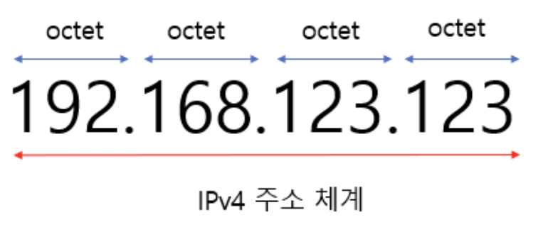
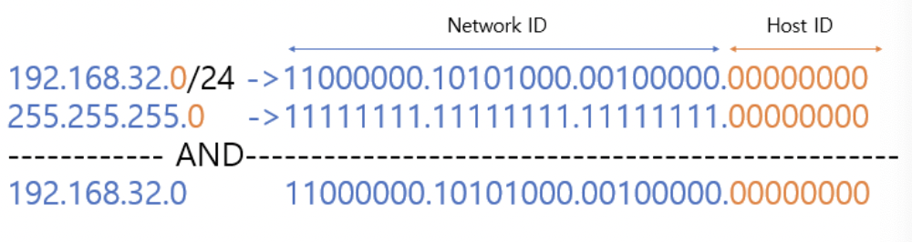

### IPv4

- IP 주소 체계, 새로운 주소 체계인 IPv6은 아직 보편화되지 않음
- 3자리 숫자가 4마디로 표기되는 방식 / **각 마디는 8bit**씩 총 **32bit**로 처리
- 각 마디는 옥텟(octet) 이라고 부름

### IPv4 클래스

- IP 주소는 대역에 따라 A~E 클래스로 나눌 수 있음
- 클래스 내에서 순서대로 Network ID와 Host ID를 구분

|       |                                            |                |
|-------|--------------------------------------------|----------------|
| A 클래스 | 네트워크 ID: 8bit, 호스트 ID: 24bit               | 첫 번째 옥텟:       |
|       | 하나의 네트워크가 가질 수 있는 호스트 수가 가장 많음 (대규모 네트워크)  | 0~127 (0xxx)   |
| B 클래스 | 네트워크 ID: 16bit, 호스트 ID: 16bit              | 첫 번째 옥텟:       |
|       | 하나의 네트워크가 가질 수 있는 호스트 수: 2^16-2 (중규모 네트워크) | 128~191 (10xx) |
| C 클래스 | 네트워크 ID: 24bit, 호스트 ID: 8bit               | 첫 번째 옥텟:       |
|       | 하나의 네트워크가 가질 수 있는 호스트 수: 2^8-2 (소규모 네트워크)  | 192~223 (110x) |
| D 클래스 | 멀티캐스팅용, 잘 쓰이지 않음                           |                |
| E 클래스 | 연구/개발용 혹은 미래에 사용하기 위해 남겨놓은 클래스             |                |

- 이때, 1개의 네트워크 영역이 가질 수 있는 호스트 ID(0000..~1111..) 중 2개를 제외해야 함
    - 시작 주소인 0000…0 은 **네트워크 주소**로 사용
    - 마지막 주소인 1111…1 은 **브로드캐스트 주소**로 사용

<aside>
💡 이 방식은 비효율적 → 하나의 네트워크를 부여할 때 남는 Host ID가 있을 수 있기 때문
→ 서브넷으로 하나의 네트워크 안에 또다른 네트워크를 생성하자!

서브넷: IP주소에서 네트워크 영역을 부분적으로 나눈 부분 네트워크

</aside>

### 서브넷 마스크

- 서브넷 마스크 → 서브넷을 만들 때 사용되는 것
- IP 주소 체계의 Network ID와 Host ID를 분리하는 역할
    - 원본 네트워크를 여러 개의 네트워크로 분리
    - 이 과정을 **서브넷팅** 이라고 한다.
- 서브넷 마스크는 이진수 기준, **네트워크 ID를 1로, 호스트 ID를 0으로** 표현한다.
    
    
    

- IP주소를 보면 192.168.32.0/24처럼 `/24` 같은 표시가 붙어있는 것을 확인할 수 있는데,
    
    이는 서브넷 마스크에서 왼쪽에서부터 **1의 개수, 즉 Network ID의 비트 수**를 뜻한다.
    
- 즉 /24는 해당 IP 서브넷 마스크의 왼쪽에서부터 24개가 1이라는 뜻

### 서브넷팅

- IP 주소 낭비를 방지하기 위해 원본 네트워크를 여러 개의 서브넷으로 분리하는 과정
- 즉, **서브넷 마스크의 비트 수를 증가시키는 것**!!
    - 할당할 수 있는 네트워크 아이디가 2배수로 증가, Host ID의 수는 2배수로 감소
    - `/24`였던 서브넷 마스크를 `/25`로 변경하면, 네트워크 ID의 비트 수가 하나 늘어난다.
- 각 서브넷들은 또한 본인의 Network Address(x.x.x.0)과 Broadcast Address를 가진다.
