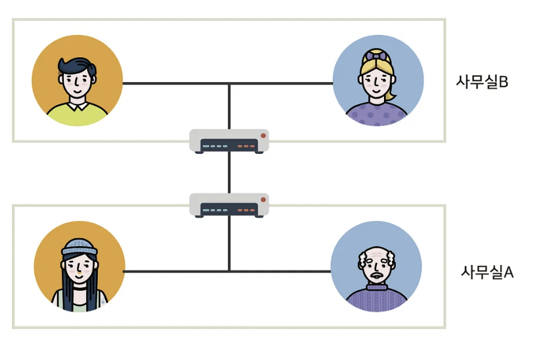
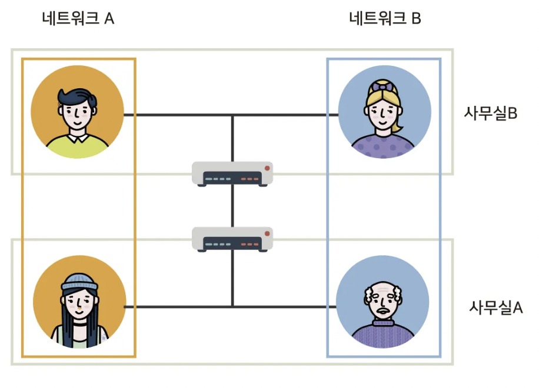
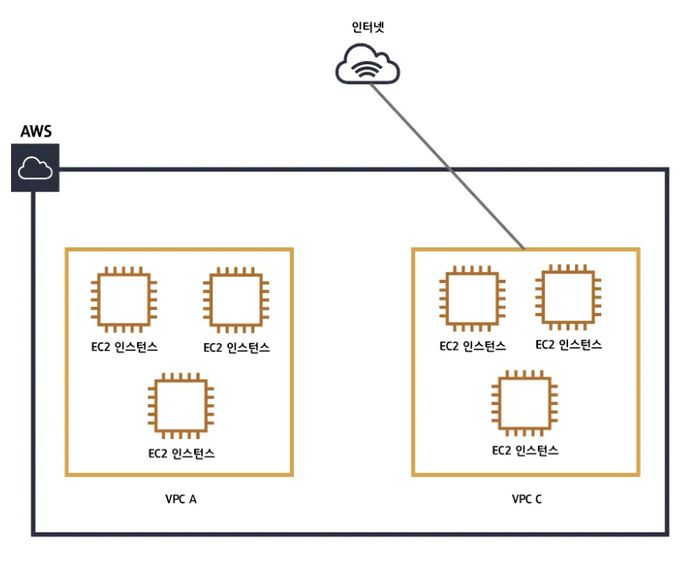
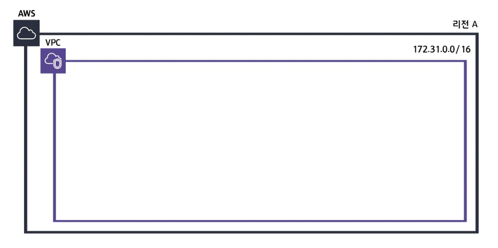
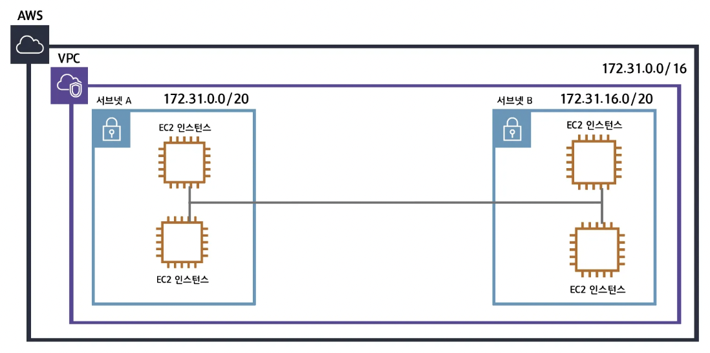
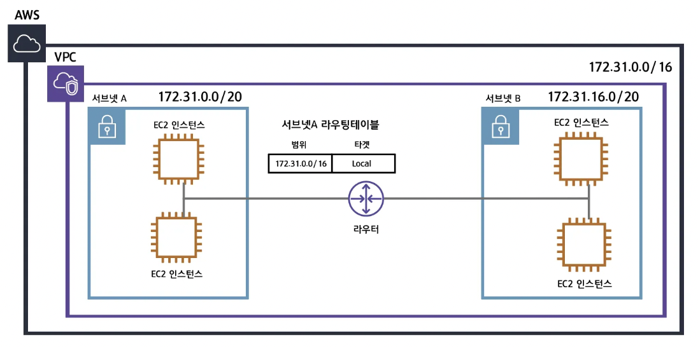
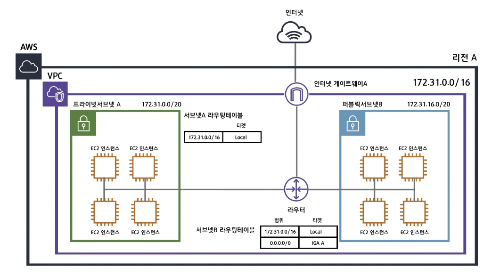
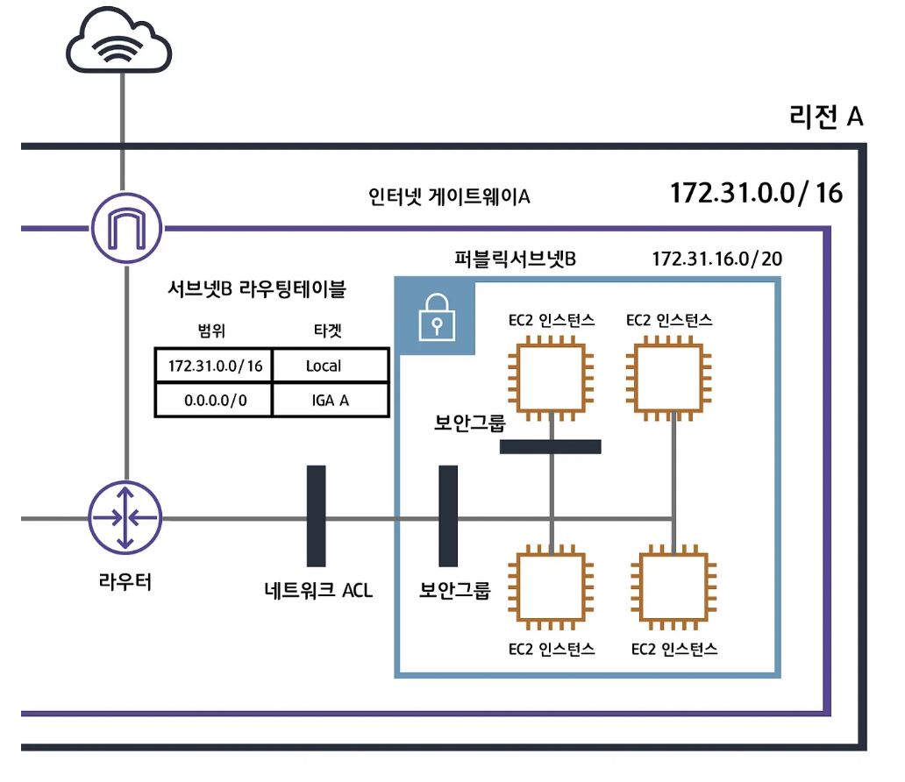
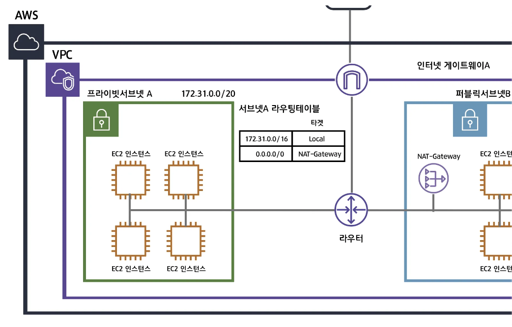

### VPN (Virtual Private Network)

- 가상 사설망 → 실제 사설망이 아닌 가상의 사설망
- 만약 아래 그림과 같이 회사의 네트워크가 구성되어 있고
    
    보안상의 이유로 직원간 네트워크를 분리하고 싶다면,
    
    
    
    건물의 내부선을 다 뜯어고쳐야 하며 다시 전용선을 깔아주어야 한다.
    
    이를 위해 **가상의 망 VPN**을 사용
    

> 💡 VPN : 네트워크 A와 네트워크 B가 실제로 같은 네트워크상에 있지만 논리적으로 다른 네트워크인 것처럼 동작한다. (가상 사설망) </aside>

- VPN을 구축한 네트워크
    
    
    

### VPC와 EC2에 대한 설명

- 간단한 예제
    
<aside> 🏠 당신이 집을 가지고 있다고 가정해봅시다. 이 집 안에는 여러 개의 방이 있습니다. 각 방은 서로 다른 용도로 사용되고 있습니다.
한 방에는 가족들이 모여 식사를 하고, 다른 방에는 공부를 하거나 취미 생활을 즐기기 위해 사용되고 있습니다. 
그리고 각 방은 문으로 분리되어 있어서 다른 방의 활동이 다른 방에 영향을 미치지 않습니다. 
이것을 EC2 인스턴스와 VPC로 비유해 보겠습니다. EC2 인스턴스는 클라우드에서 실행되는 가상 서버라고 생각할 수 있습니다.
각 EC2 인스턴스는 VPC(가상 개인 클라우드) 안에 있는 방들과 같습니다. 각 인스턴스는 자체적으로 작동하며 다른 EC2 인스턴스와 독립적으로 행동합니다.
이것이 말하는 바는 한 EC2 인스턴스가 다른 EC2 인스턴스에게 영향을 미치지 않는다는 것입니다. 즉, 한 인스턴스에서 문제가 발생해도 다른 인스턴스는 계속해서 정상적으로 작동할 수 있습니다.
하지만 이 VPC(가상 개인 클라우드) 안에서는 EC2 인스턴스들끼리 서로 통신할 수 있습니다.
이것은 마치 집 안의 각 방이 문을 통해 서로 연결되어 있어서 가족들끼리 대화할 수 있는 것과 같습니다.
그러나 이 네트워크는 외부에서는 보이지 않습니다. 즉, 인터넷에 연결되지 않은 독립적인 네트워크로 작동합니다.   
따라서 EC2 인스턴스들은 VPC 안에서 서로 통신할 수 있으면서도 외부에는 보이지 않는 독립적인 개인 네트워크를 형성합니다.</aside>
    
- EC2 인스턴스 → 클라우드에서 실행되는 가상 서버
    - EC2는 VPC(가상 개인 클라우드) 안에 있는 방들과 같다.
    - 각 인스턴스는 자체적으로 작동하며 다른 EC2 인스턴스와 독립적으로 행동
    - 즉, 한 인스턴스에서 문제가 발생해도 다른 인스턴스는 정상적으로 작동
- 하지만 VPC(가상 개인 클라우드) 안에서는 EC2 인스턴스끼리 서로 통신할 수 있다.
    - 그러나 이 **EC2 인스턴스끼리의 네트워크는 외부에서는 보이지 않는다**.
    - 즉, **인터넷에 연결되지 않은 독립적인 개인 네트워크**로 작동

<aside>💡 여기서 알 수 있는 것: VPC는 클라우드 환경에서 자신만의 ‘프라이빗 네트워크’를 만들어서 보안과 관리를 편리하게 할 수 있게 해주는 기술이라는 것</aside>

### VPC

- VPC가 없다면 EC2 인스턴스들은 외부로부터 보호/단절되지 않고,
    
    기본적으로 인터넷과 연결되어 있으며 하나의 기본 네트워크에 모두가 연결되어 있음
    
    - 모든 EC2 인스턴스가 동일한 네트워크 내에 위치하므로 서로 직접 통신할 수 0
    - 인터넷 게이트웨이를 통해 외부 인터넷에 액세스할 수 있음 → 보안에 제한적
- 따라서 보다 세분화된 네트워크 관리 및 보안 요구사항을 충족하기 위해,
    
    사용자는 **VPC를 생성하고 EC2 인스턴스들을 해당 VPC 내에 배치**하여 세밀한 네트워크를 구성
    
- 각각의 인스턴스를 **논리적으로 분리**하고 `보안 그룹` 등을 사용하여 엄격한 보안 정책을 적용한다.

- VPC를 사용하면 위 그림과 같이 **VPC별로 네트워크를 구성**할 수 있고, (VPC 내부 격리된 네트워크)
- 각각의 VPC에 따라 **다르게 네트워크 설정**을 줄 수 있다.
- 또한 각각의 VPC는 **완전히 독립된 네트워크**처럼 작동한다.
- 

### VPC 구축 과정 1 - VPC

- VPC의 IP 범위를 사설 IP 대역에 맞추어 구축
    - `사설 IP`: 우리끼리 사용하는 IP주소 대역 (private 함)
- 한번 설정된 IP대역은 수정할 수 없으며, 각 VPC는 하나의 리전에 종속
- **각 VPC는 완전히 독립적**이기 때문에, 만약 VPC 간 통신을 원한다면 VPC 피어링 서비스를 고려

### VPC 구축 과정 2 - 서브넷

- `서브넷` → **VPC를 잘게 쪼개는 과정**
- 서브넷을 나누는 이유 : 더 많은 네트워크망을 만들기 위해!
- 각각의 서브넷 안에 EC2와 같은 리소스들을 위치시킬 수 있다.

<aside>
> 💡 **생각해 볼 점
> VPC 안에서 서브넷은 완전히 다른 네트워크처럼 동작한다. 이는 서로 소통할 수 없음을 의미할까?**
>
> - 각 서브넷이 사설 IP 중 서로 같은 IP 주소 범위를 공유하는 경우, 기본적으로 서로 다른 서브넷 간에도 사설 IP 주소를 통해 직접 통신이 가능함. 
> - 하지만 서브넷이 서로 다른 IP 주소 범위를 사용하는 경우에는 기본적으로 서로 통신할 수 없다.
> → 이 경우 VPC 내에서의 통신을 위해 라우팅 테이블을 구성하여 서로 통신하게 할 수 있음!

</aside>

### VPC 구축 과정 3 - 라우팅 테이블과 라우터

- 네트워크 요청이 발생하면 데이터는 우선 라우터로 향하게 된다.
    - `라우터`: 목적지
    - `라우팅 테이블`: 각 목적지에 대한 이정표
- 이는 VPC 내부에서 소통가능하게 함 (특히, 대역이 다른 서브넷들끼리) → 목적지가 Local
- 아예 **VPC 외부의 인터넷과 소통하고 싶다면** 어떻게 해야 할까? → **인터넷 게이트웨이**

### VPC 구축 과정 4 - 인터넷 게이트웨이

- VPC와 인터넷을 연결해주는 하나의 관문
- 라우팅 테이블을 정의하는 법
    
| 범위          | 타겟                |   |
|---------------|---------------------|---|
| 0.0.0.0/0     | IGA A               |   |
| → 모든 트래픽에 대하여 | → 인터넷 게이트웨이로 향하도록 함 |   |
|               |                     |   |
|               |                     |   |

- 즉, 라우팅 테이블에 기재된 다른 목적지들과 타겟이 매칭되지 않는다면,
    
    그 모든 패킷을 적혀있는 해당하는 IGA로 보낸다
    

- `퍼블릭 서브넷` : 인터넷과 연결되어 있는 서브넷
- `프라이빗 서브넷`: 인터넷과 연결되어있지 않은 서브넷

### VPC 구축 과정 5 - 네트워크 ACL과 보안그룹

- 네트워크 ACL과 보안그룹 → `방화벽`과 같은 역할을 함
- `보안그룹` : Stateful, 모든 허용을 차단하도록 기본설정
    - 서브넷은 물론 각각의 EC2 인스턴스에도 적용할 수 있다.
- `네트워크 ACL` : Stateless, 모든 트래픽을 허용하도록 기본설정
    - 서브넷 단위로 적용되며, 리소스별로는 설정할 수 없음
- 네트워크 ACL과 보안그룹이 충돌한다면 → 보안그룹이 더 높은 우선순위

### NAT 게이트웨이

- 프라이빗 서브넷이 인터넷과 통신하기 위한 아웃바운드 인스턴스.
- 프라이빗 서브넷에서 외부로 요청되는 아웃바운드 트래픽을 받아 인터넷 게이트웨이와 연결한다.
    - **외부에서 요청되는 인바운드는 필요X !**
