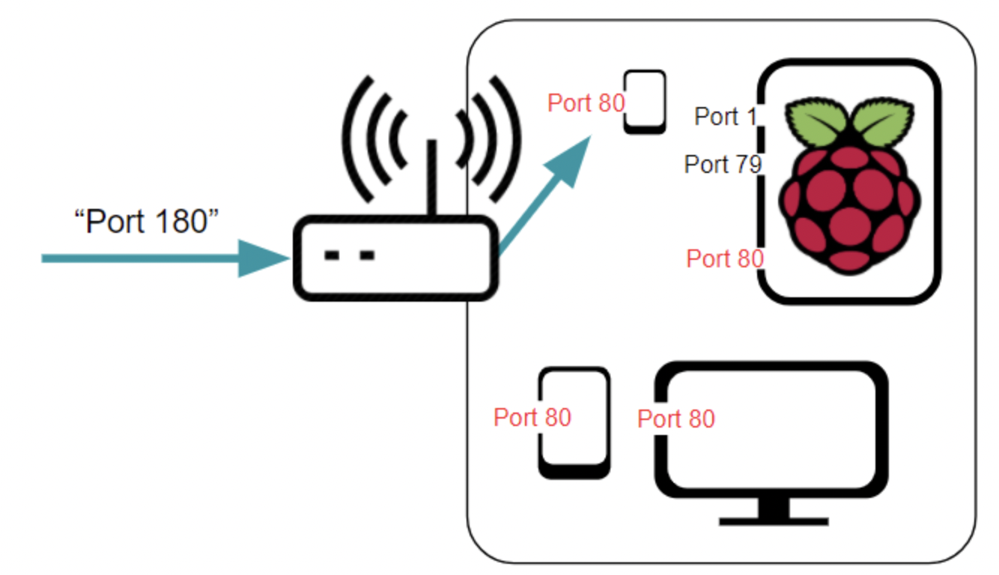
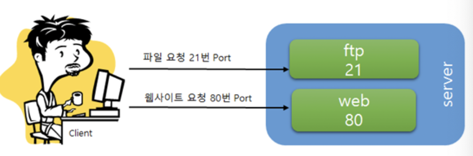

> 💡 특정 포트로 들어오는 트래픽을 다른 포트나 다른 IP주소로 전달하여 서비스에 접속할 수 있게 함

### 왜 포트포워딩이 필요한가?

> 인터넷을 통해서 다른 사람들이 공유기의 연결된 컴퓨터 1의 웹서버에 접근하기 위해서는 컴퓨터 1의 아이피를 알려줄 수는 없습니다.
> 사설 아이피 대역은 여기 저기서 사용하기 때문에 공인 아이피처럼 특정한 기기를 가리키지 않습니다. 그래서 공유기가 보유한 공인 아이피를 알려줘야 합니다.
> 그러면 다른 사람들이 http://12.34.56.78:80 주소를 인터넷 브라우저에 입력하면 웹 서버에 연결이 될까요?
> 하지만 공인 아이피의 80번 포트로 들어오는 연결은 공유기에 도달하면 끝나버립니다.
> 왜냐하면 공인 아이피로 들어온 80번 포트의 연결을 공유기에서 컴퓨터 1, 2, 3 중에 어떤 곳으로 보내줘야 할 것인지를 판단하지 못하기 때문입니다.
> 그렇기 때문에 공인 아이피로 들어오는 80번 포트의 연결을 컴퓨터 1의 80번 포트로 연결하라고 공유기에 설정을 해야 하는 것이며, 이것을 **`포트 포워딩(전달)`** 이라고 하는 것입니다.

- 통신 기기들은 여러 개의 포트를 가지고 있다.
    
    포트는 비유하자면 ‘문’과 같은 것
    
- 통신 기기들은 처리하는 역할에 따라 포트를 달리해서 데이터의 출입을 혼동 없이 관리한다.
- 그런데 포트포워딩이 설정되지 않았다면, 80번 포트로 요청을 받았을 때 공유기 입장에서는
    
    어떤 기기인지 특정하지 못한다. → **‘Port 80’ 을 열어줄 수 있는 기기가 한두 대가 아니기 때문.**
    
- 이런 모호함을 해결하기 위해 포트포워딩이 필요 (교통정리.)

### 포트포워딩 설정

- 포트포워딩 → 공유기의 포트를 이용해 **공유기에 물린 기기들의 특정 포트**에 진입할 수 있는 기능
- Ex) 포트포워딩 설정에서 '**Port 180으로 진입하면, 핸드폰의 Port 80 으로 요청을 보내줘**'라고 지시를 해둠으로써, 핸드폰의 Port 80 에 접근할 수 있다.
    
    
    
- 여기서 **180은 사용자가 지정할 수 있는 임의의 숫자**이며,
    
    **이 숫자를 지정하는 것이 포트포워딩 설정!**
    
- Port 180 으로 진입 시 핸드폰의 Port 80 으로, Port 2580 으로 진입 시 라즈베리 파이의 Port 80 으로 요청을 전달하는 식으로 사용자의 편의 대로 전달(포워딩) 설정을 하는 것이 가능
- 이 설정을 해두고 외부에서 Port 180으로 진입하면 **공유기 외부에서도 내부 기기에 접속**할 수 있다.

### 포트 포워딩에서 참고할 사항

- 외부에서 접속하는 포트와 내부에서 연결하는 포트는 서로 다를 수 있다. (80을 8080으로 포워딩 가능)
- 내부에서 연결하려는 포트는, 연결하고자 하는 장비의 아이피를 반드시 지정해야 한다.
- 하나의 포트로 들어오는 연결을 두 아이피로 포워딩 할 수 없다. (하나의 포트는 하나의 포워딩만 가능)
- 포워딩하고자 하는 아이피는 반드시 공유기가 할당한 사설 아이피여야만 한다.
