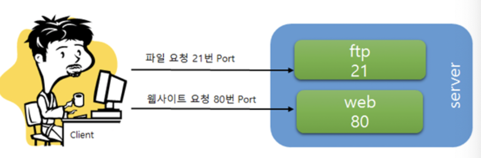

### 포트

- **컴퓨터의 Lan선은 하나인데 통신을 필요로 하는 프로그램이 다수일 때,**
    
    **이 다수의 프로그램을 구별할 수 있는 번호**
    

### 포트 번호

- 포트는 숫자로 표현하게 되어 있으며 65535번까지 존재
- 아래와 같이 3종류로 표현할 수 있음
    
    
    | 0번~1023버 | 잘 알려진 포트 |
    | --- | --- |
    | 1024번~49151번 | 등록된 포트 |
    | 49152번~65535번 | 동적 포트 |

- 잘 알려진 포트의 대표적 예
  
    | 20 | FTP(data) |
    | --- | --- |
    | 21 | FTP(제어) |
    | 22 | SSH |
    | 23 | 텔넷 |
    | 53 | DNS |
    | 80 | 월드 와이드 웹 HTTP |
    | 119 | NNTP |
    | 443 | TLS/SSL 방식의 HTTP |
    - 파일 요청은 일반적으로 21번 포트, 그리고 http요청은 80 포트를 이용
- 이때 서버는 21번 포트로 오는 요청은 파일 요청으로, 80포트로 오는 요청은 웹사이트
    
    요청으로 이해하게 되어 여러 역할을 할 수 있게 됨
