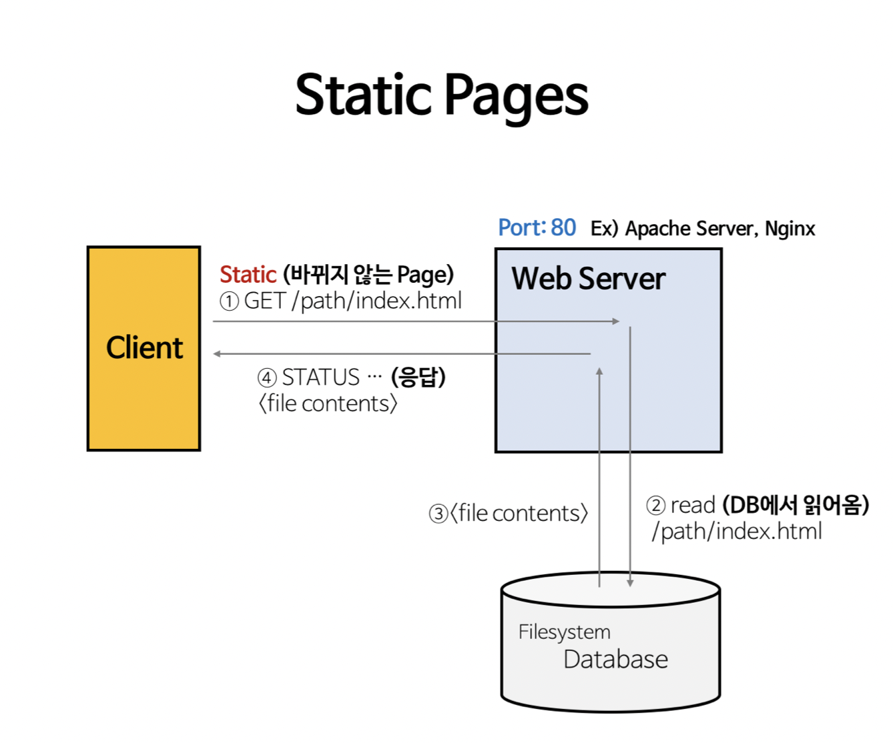
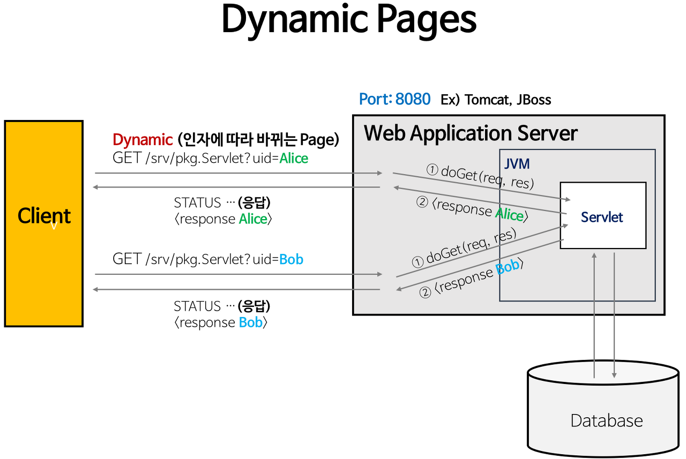
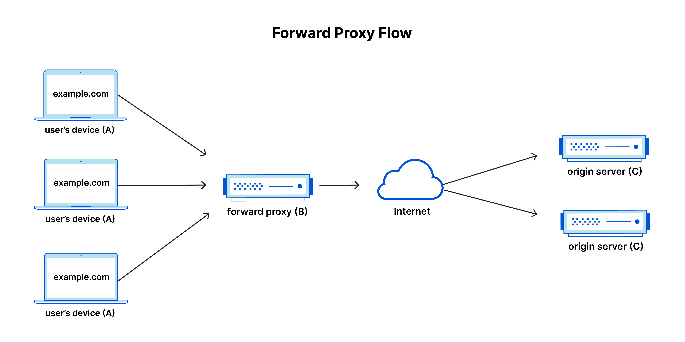
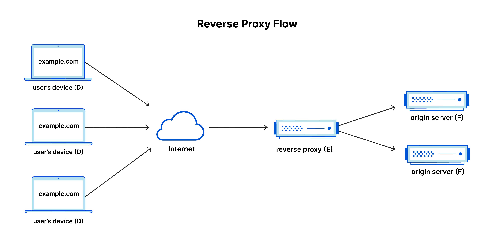

# Chapter 3. Web Server & Web Application Server(WAS), Reverse Proxy

> UMC 워크북 3주차 키워드에 관한 내용을 정리해보겠습니다 :)

# ✅ 1. Web Sever

> 웹 서버는 정적 콘텐츠(HTML 파일, 이미지, CSS, JavaScript 등)를 클라이언트에게 전달하는 역할을 한다. 클라이언트가 웹 페이지나 파일을 요청하면, 웹 서버는 해당 파일을 찾아서 응답으로 보낸다. (ex. Apache, Nginx, ...)

## 웹 서버의 기능
### 1) 단순히 정적인 콘텐츠를 제공
클라이언트로부터 정적인 콘텐츠를 요청받으면 WAS에게 추가로 요청을 하지 않고 바로 정적 콘텐츠를 응답을 통해 제공한다.

### 2) 동적인 콘텐츠를 제공하기 위해 WAS에 요청 전달
클라이언트로부터 요청을 받으면, WAS에 전달한 뒤 처리 결과를 받아 다시 클라이언트에게 전달한다.

## 스케일링 기법
웹 서버는 정적 콘텐츠를 제공하는 데 특화되어 있으므로, 주로 수평 확장을 통해 부하를 분산한다. 여러 대의 웹 서버를 둔 뒤 로드 밸런서 등을 이용하여 요청을 분산시킨다.

# ✅ 2. Web Application Server

> 웹 애플리케이션 서버는 동적 콘텐츠를 생성하고 실행하기 위한 서버이다. 이는 데이터베이스와 상호작용하고, 비즈니스 로직을 처리하며, 동적인 웹 페이지를 생성하는 데 사용된다.

## 웹 애플리케이션 서버의 기능
### 1) 서블릿 컨테이너(Servlet Container)
서블릿 컨테이너는 자바 서블릿을 실행하고 관리하는 환경을 제공한다. 서블릿은 클라이언트의 요청을 처리하고, 동적인 콘텐츠를 생성하는 자바 프로그래밍 기술이다.
웹 애플리케이션 서버는 서블릿 컨테이너를 내장하고 있어서, 클라이언트의 요청이 들어오면 이를 적절한 서블릿으로 라우팅하여 처리한다.

### 2) JSP(JavaServer Pages) 컨테이너
JSP는 동적인 웹 페이지를 생성하기 위한 자바 기반의 서버 사이드 스크립팅 언어이다. JSP 컨테이너는 JSP 페이지를 실행하고, 그 결과를 HTML 형태로 클라이언트에게 반환한다.

### 3) 엔터프라이즈 자바빈즈(Enterprise JavaBeans, EJB)
EJB는 자바 기반의 엔터프라이즈 애플리케이션 개발을 위한 컴포넌트 모델이다. 이를 통해 분산 환경에서의 트랜잭션 처리, 보안, 데이터베이스 연동 등을 쉽게 구현할 수 있다.
웹 애플리케이션 서버는 EJB 컨테이너를 제공하여 EJB 컴포넌트의 라이프사이클을 관리하고, 클라이언트의 요청에 따라 이를 실행한다.

### 4) 데이터베이스 연동 및 트랜잭션 관리
웹 애플리케이션은 종종 데이터베이스와 상호작용해야 한다. WAS는 데이터베이스 연결 풀링(Database Connection Pooling)을 관리하여 데이터베이스 연결을 효율적으로 관리하고, 트랜잭션 처리를 지원한다.

### 5) 보안 기능
웹 애플리케이션 서버는 사용자 인증 및 권한 부여와 같은 보안 기능을 제공한다. 사용자가 웹 애플리케이션에 접근할 때 인증을 요구하고, 암호화된 통신을 통해 데이터를 안전하게 전송한다.

### 6) 세션 관리
세션은 클라이언트와 서버 간의 상태를 유지하는 데 사용된다. 웹 애플리케이션 서버는 세션을 관리하여 클라이언트의 요청을 식별하고, 세션 데이터를 저장하고 검색한다.

### 7) 로드 밸런싱과 클러스터링
웹 애플리케이션 서버는 여러 대의 서버 인스턴스를 클러스터로 구성하여 부하 분산과 고가용성을 제공할 수 있다. 로드 밸런서를 통해 요청을 분산하고, 클러스터 간의 통신을 관리한다.

## 스케일링 기법
웹 애플리케이션 서버는 동적 콘텐츠를 처리하고 비즈니스 로직을 실행하는 데 집중되어 있다. 웹 애플리케이션 서버도 수평 확장이 가능하지만, 주로 클러스터링과 로드 밸런싱을 통해 부하를 분산한다.

# ✅ 3. Forward Proxy Server
> 프록시, 프록시 서버, 웹 프록시라고도 하는 정방향 프록시는 클라이언트 시스템 그룹 앞에 위치하는 서버이다. 이러한 컴퓨터가 인터넷의 사이트 및 서비스에 요청하면 프록시 서버가 이러한 요청을 가로채고 중개자처럼 해당 클라이언트를 대신하여 웹 서버와 통신한다.

- A: 사용자의 가정용 컴퓨터
- B: 정방향 프록시 서버
- C: 웹 사이트의 원본 서버(웹 사이트 데이터가 저장되는 곳)

표준 인터넷 통신에서는, 컴퓨터 A가 컴퓨터 C에 직접 연결하고 클라이언트는 원본 서버에 요청을 보내며 원본 서버가 클라이언트에 응답한다. 정방향 프록시가 설정되면 A가 대신 B에 요청을 보내고 B가 요청을 C로 전달한다. 그런 다음 C가 B에게 응답을 보내고 B가 응답을 A에게 다시 전달한다.

## 정방향 프록시 서버의 존재 이유?
정방향 프록시를 사용하려는 이유가 몇 가지 있다.

### 1) 정부 또는 기관의 검색 제한을 피하기 위해 
일부 정부, 학교, 기타 조직에서는 방화벽을 사용하여 사용자에게 제한된 버전의 인터넷에 대한 액세스 권한을 부여한다. 정방향 프록시를 사용하면 사용자가 방문하는 사이트에 직접 연결하지 않고 프록시에 연결할 수 있으므로 이러한 제한을 피할 수 있다.

### 2) 특정 콘텐츠에 대한 액세스를 차단하기 위해
반대로 사용자 그룹이 특정 사이트에 액세스하는 것을 차단하도록 프록시를 설정할 수도 있다. 예를 들어 학교 네트워크에서는 콘텐츠 필터링 규칙을 활성화하는 프록시를 통해 웹에 연결하도록 구성되어 Facebook 및 기타 소셜 미디어 사이트의 응답 전달을 거부할 수 있다.

### 3) 온라인에서 자신의 신원을 보호하기 위해 
어떤 경우에는 일반 인터넷 사용자가 단순히 온라인에서 익명성을 원하지만, 다른 경우에는 정부가 반체제 인사에게 심각한 처벌을 가할 수 있는 곳에 인터넷 사용자가 살 수도 있다. 웹 포럼이나 소셜 미디어에서 정부를 비판하면 이러한 사용자에게 벌금이나 징역형이 선고될 수 있다. 이러한 반체제 인사 중 한 명이 정방향 프록시를 사용하여 정치적으로 민감한 댓글을 게시하는 웹 사이트에 연결하는 경우, 댓글 게시에 사용된 IP 주소로 반체제 인사를 추적하는 일이 더 어려워진다. 프록시 서버의 IP 주소만 표시된다.

# ✅ 4. Reverse Proxy Server
> 역방향 프록시는 하나 이상의 웹 서버 앞에 위치하여 클라이언트의 요청을 가로채는 서버이다. 이것은 프록시가 클라이언트 앞에 위치하는 정방향 프록시와 다르다. 역방향 프록시를 사용하면 클라이언트가 웹 사이트의 원본 서버에 요청을 보낼 때 역방향 프록시 서버가 네트워크 에지에서 해당 요청을 가로챈다. 그런 다음 역방향 프록시 서버가 원본 서버에 요청을 보내고 응답을 받는다.

- D: 사용자의 가정용 컴퓨터
- E: 역방향 프록시 서버
- F: 원본 서버

일반적으로 D의 모든 요청은 F로 직접 이동하고, F는 D에게로 직접 응답을 보낸다. 역방향 프록시를 사용하면 D의 모든 요청이 E로 직접 이동하고, E는 요청을 F에게로 보내며 F로부터 응답을 받는다. E는 그런 다음 적절한 응답을 D에게 전달한다.

## 역방향 프록시 서버의 이점은?
### 1) 부하 분산 
매일 수백만 명의 사용자를 확보하는 인기 있는 웹 사이트에서는 단일 원본 서버로 들어오는 모든 사이트 트래픽을 처리하지 못할 수 있다. 대신, 사이트에서는 동일한 사이트에 대한 요청을 모두 처리하는 서로 다른 서버 풀에 분산될 수 있다. 이 경우 역방향 프록시는 단일 서버에 과부하가 걸리는 것을 방지하기 위해 들어오는 트래픽을 여러 서버에 고르게 분산하는 부하 분산 솔루션을 제공할 수 있다. 서버가 완전히 실패하는 경우 다른 서버가 트래픽을 처리하기 위해 나설 수 있다.

### 2) 공격으로부터 보호 
역방향 프록시를 사용하면 웹 사이트 또는 서비스에서 원본 서버의 IP 주소를 공개할 필요가 없다. 이로 인해 공격자가 DDoS 공격과 같은 표적 공격을 활용하기가 훨씬 더 어려워진다. 대신 공격자는 Cloudflare의 CDN과 같은 역방향 프록시만 대상으로 지정할 수 있다. 이는 사이버 공격을 방어하기 위해 더 엄격한 보안과 더 많은 자원을 갖게 된다.

### 3) 전역 서버 부하 분산 (GSLB) 
이 부하 분산 형식에서 웹 사이트는 전 세계 여러 서버에 분산될 수 있으며 역방향 프록시는 클라이언트를 지리적으로 가장 가까운 서버로 보낸다. 그러면 요청과 응답이 이동해야 하는 거리가 줄어들어 로드 시간이 최소화된다.

### 4) 캐싱 
역방향 프록시도 콘텐츠를 캐시할 수 있으므로 성능이 향상된다. 예를 들어, 파리에 있는 사용자가 로스앤젤레스에 있는 웹 서버가 있는 역방향 프록시 웹 사이트를 방문하는 경우, 사용자는 실제로 파리에 있는 로컬 역방향 프록시 서버에 연결할 수 있다. 그러면 이 서버는 LA에 있는 원본 서버와 통신해야 합니다. 프록시 서버는 그런 다음 응답 데이터를 캐시(또는 임시 저장)할 수 있다. 사이트를 탐색하는 파리의 후속 사용자는 파리의 역 프록시 서버에서 로컬로 캐시된 버전을 가져오므로 성능이 훨씬 빨라집니다.

### 5) SSL 암호화 
각 클라이언트에 대한 SSL(또는 TLS) 통신의 암호화 및 암호 해독은 원본 서버의 경우에 계산 비용이 많이 들 수 있다. 역방향 프록시는 들어오는 모든 요청을 해독하고 나가는 모든 응답을 암호화하여 원본 서버의 귀중한 리소스를 확보하도록 구성할 수 있다.

## 정방향 프록시와 역방향 프록시의 차이는?
정방향 프록시와 역방향 프록시의 차이는 미묘하지만, 중요하다. 

요약하면 정방향 프록시는 클라이언트 앞에 위치하며 원본 서버가 해당 특정 클라이언트와 직접 통신하지 못하도록 하는 것이다. 

반면에 역방향 프록시는 원본 서버 앞에 위치하며 어떤 클라이언트도 원본 서버와 직접 통신하지 못 하도록 한다.

프록시 서버가 클라이언트 바로 앞에 위치하는지 아니면 서버의 바로 앞에 위치하는지에 따라 어디에 벽을 칠 것인가에 따라 나뉜다고 생각하면 될 것 같다.
