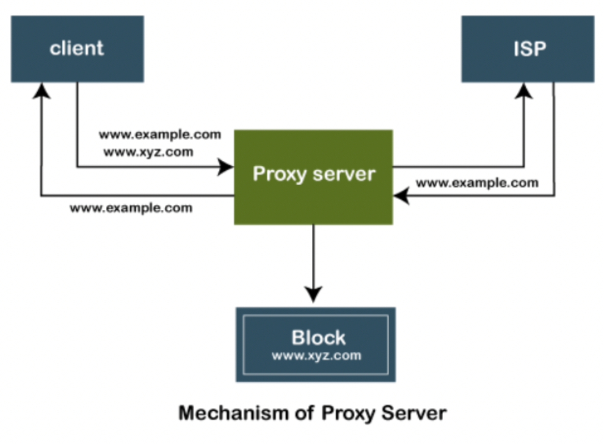
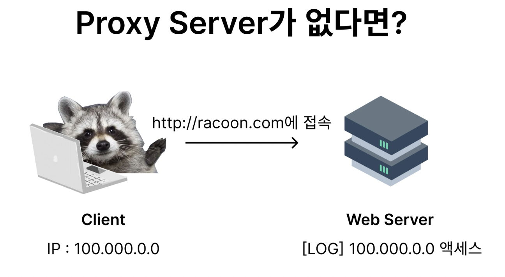
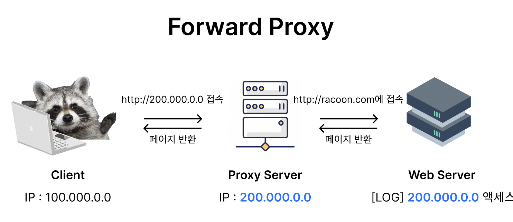
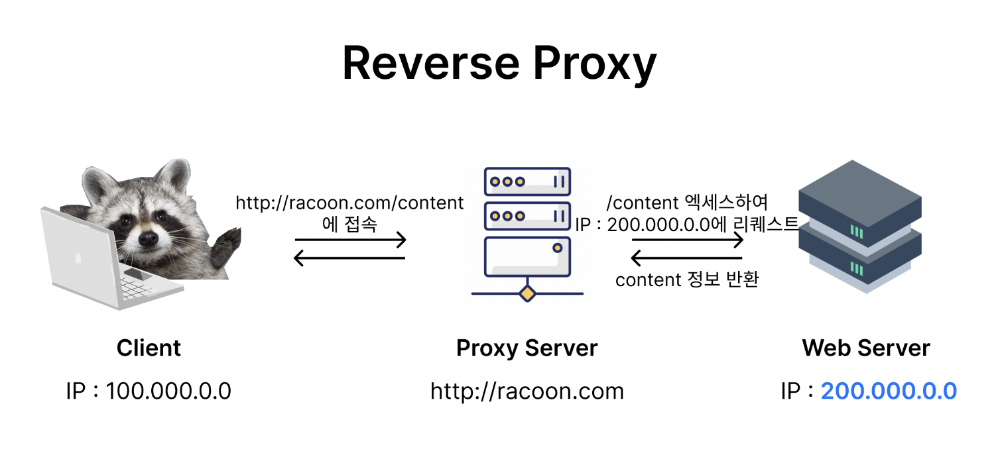
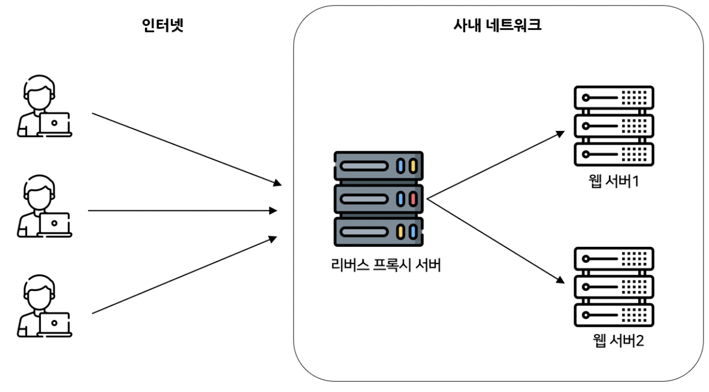

### 프록시란?

---

- 프록시(proxy)는 `대리`의 의미로,
    
    빠른 액세스와 안전한 통신을 확보하기 위한 중계 서버를 `프록시 서버`라고 일컫는다. 
    
- 클라이언트와 웹 서버 중간에 위치하고 있어, **"대리"로 통신을 받아주는 개념**이라 생각하면 된다.

> 네트워크에 연결된 모든 컴퓨터에는 IP가 있다. 
> 마찬가지로 프록시 서버는 **네트워크의 자체 IP 주소가 있는 컴퓨터**이다. 
> 그러나 때로는 제한된 웹 사이트나 서버에 액세스하여 IP주소를 표시하지 않으려는 경우도 있다. 
> 이런 경우, 프록시 서버를 사용하여 같은 결과를 달성할 수 있다.

프록시 서버는 클라이언트의 수신 요청을 수락하고 이러한 요청을 대상 서버로 전달하는 
인터넷상의 컴퓨터이며 최종 사용자와 인터넷 사이의 게이트 역할을 한다. 

앞에서 언급했듯 자체 IP 주소가 있으며, 클라이언트 시스템과 웹 서버를 글로벌 네트워크에서 분리한다.

→ 즉, 프록시 서버를 통해 다른 IP 주소를 가진 웹 사이트에 액세스 할 수 있다.

**프록시 서버는 클라이언트의 요청을 수락하고 다음 조건에 따라 응답을 생산한다.**

1.   요청된 데이터 또는 페이지가 로컬 캐시에 이미 있는 경우, 

프록시 서버 자체가 필요한 검색을 클라이언트에 제공한다.

2. 요청한 데이터 또는 페이지가 로컬 캐시에 없는 경우 프록시 서버는 해당 요청을 대상 서버로 전달한다.

3. 프록시 서버는 클라이언트에 응답을 전송하고 또한 클라이언트에 `캐시`된다.

따라서 프록시 서버는 서버뿐 아니라 클라이언트 역할도 한다고 할 수 있다.

### Forward Proxy

---

일반적으로 프록시라고 하면 포워드 프록시를 뜻한다. 
**클라이언트 대신 프록시 서버가 목적 서버에 통신해주는 구성**을 말한다.

- ex) 회사 내부 인트라넷에서 인터넷상에 있는 서버에 요청할 때 먼저 프록시 서버를 호출하는 방식.

만약 proxy server가 없다면 아래처럼 클라이언트가 직접적으로 액세스할 수 있다.

반면 포워드 프록시를 사용하면 서버에게 **클라이언트가 누구인지 감출 수** 있다. 
서버가 응답받은 IP는 포워드 프록시 서버의 IP이기 때문에 클라이언트가 누군지 알 수 없다.

- 우리가 `http://racoon.com` 페이지를 요청하면 포워드 프록시 서버가 **리소스를 대신 받아와** 클라이언트에게 내밀어준다(forward).
- **인터넷보다 프록시 서버를 먼저 호출하게 되면 포워드 프록시**인 것이다.

### Foward Proxy 이점

---

- **클라이언트 보안 측면**
    - 보통 정부, 기업 같은 기관에서 제한적인 인터넷 사용을 위한 `방화벽`과 같은 개념으로 사용
    - 방문하려는 웹에 직접적인 방문을 방지할 수 있음
    - 룰을 추가하면 사용자 전원의 외부 웹사이트로의 액세스를 필터링할 수도 있음
        
        → **무조건 프록시 서버를 경유**하기 때문!
        
- **프록시 서버는 페이지 서버의 정보를 캐싱해둔다.**
    - 다른 클라이언트가 해당 페이지를 요청할 때, 캐싱된 정보를 그대로 반환할 수 있다.
    - 서버의 부하를 줄이는 효과가 있다.
- **클라이언트의 요청은 포워드 프록시 서버를 통과할 때 암호화된다.**
    - 암호화된 요청은 다른 서버를 통과할 때 필요한 최소한의 정보만 가짐 → 보안 효과
    - 따라서 본 서버에서 IP 주소를 역추적해도 포워드 프록시 서버의 IP 주소만 보여 정체를 파악하기 어렵다.

### Reverse Proxy

---

- 포워드 프록시와 달리 Web Server 쪽에 위치하여 클라이언트의 접근을 최초로 받아
    
    리퀘스트에 해당하는 Web Server에 배분해주는 역할을 함
    
- 클라이언트는 웹 서비스에 접근할 때 **프록시 서버로 요청**하게 되고,
    
    프록시가 배후(reverse)의 서버로부터 데이터를 가져오는 방식이다.
    

리버스 프록시는 **서버가 누구인지를 감추는 역할**을 한다. 
클라이언트는 리버스 프록시 서버를 먼저 호출하게 되기에 실제 서버의 IP를 알 수 없다.

내부 서버가 직접 서비스를 제공해도 되지만 이렇게 구성하는 이유는 **보안** 때문이다.

> 보통 기업의 네트워크 환경에서는 `DMZ`라고 부르는 내부 네트워크/외부 네트워크 사이에 위치하는 구간이 존재한다. 
> 이 구간에는 보통 메일 서버, 웹 서버, FTP 서버 등 외부 서버를 제공하는 서버가 위치하게 된다.
> WAS를 `DMZ`에 놓고 서비스해도 되지만 WAS는 DB와 연결되어 있으므로, WAS가 해킹당할 경우 DB까지 해킹당할 수 있는 문제를 초래할 수 있다. 
> 따라서 **리버스 프록시 서버를** `DMZ`**에 두고 실제 서비스 서버는 내부망에 위치시킨 후 서비스하는 것이 일반적**이다.

<aside>
🔥 흔히 서버 아키텍처로 구성하는 web server(nginx) - WAS(tomcat) 분리 형태를 reverse proxy라고 보면 됨 !
</aside>

### Reverse Proxy 이점

---

- **서버를 부담 분산할 수 있다.**
    - 유명한 웹 사이트 → 대량의 트래픽을 하나의 싱글 서버로 감당하기 어려움
    - 리버스 프록시 서버를 여러개의 본 서버들 앞에 두어 특정 서버가 과부화되 지 않게 `로드밸런싱`
    - 클라이언트 요청을 여러 대의 서버로 분산시켜서, 
    서버의 부하를 골고루 분산하여 서버 성능을 최적화하고, 서버 다운 시간을 줄인다.
- **확장성**
    - 새로운 서버를 간단히 프록시 서버에 추가하거나 필요 없어진 서버를 제거할 수 있다.
- **서버 보안 측면**
    - 리버스 프록시 서버를 두면 본 서버의 IP 주소를 감출 수 있다 → 해킹 방어
    - 요청을 필터링하고 의심스러운 트래픽을 차단하여 악의적인 트래픽으로부터 백엔드 서버를 보호
- **포워드 프록시와 유사하게 캐싱 기능을 갖고 있다.**
    - 자주 액세스하는 콘텐츠를 캐시하고 클라이언트에 직접 제공 → 응답 시간 향상

### Foward Proxy & Reverse Proxy

---

- 포워드 프록시 : 클라이언트 단, 리버스 프록시: 서버 단

| Forward Proxy 서버 | 클라이언트 앞에 놓여져 있음 |
| --- | --- |
| Reverse Proxy 서버 | 웹서버/WAS 앞에 놓여 있음 |

| Forward Proxy 서버 | `클라이언트를 보호`, 직접 서버 URL로 요청을 보내고 내부망에서 포워드 프록시 서버를 호출하여 프록시가 요청을 보내게 되어 → 서버에게 클라이언트를 감출 수 있다. |
| --- | --- |
| Reverse Proxy 서버 | `서버를 보호`, 프록시 서버 URL로만 접근이 가능하여 본 서버의 IP 정보를 숨길 수 있다. |

| Forward Proxy 서버 | 내부망에서 클라이언트와 Proxy 서버가 통신하여 인터넷을 통해 외부에서 데이터를 가져온다. |
| --- | --- |
| Reverse Proxy 서버 | 내부망에서 Proxy 서버와 내부망서버가 통신하여 인터넷을 통해 요청이 들어오면 Proxy 서버가 받아 응답해준다. |

<aside>
💡 3주차 내용
`포워드 프록시` → 또 다른 외부(다른 컴퓨터) 서버로 요청을 보내주는 것
`리버스 프록시` → 내부(같은 컴퓨터)의 다른 서버로 요청을 보내주는 것
</aside>