# Chapter 4. DATABASE 설계 & AWS RDS 설정

> UMC 워크북 4주차 키워드에 관한 내용을 정리해보겠습니다 :)

# ✅ 1. 키
> DB에서의 "키"는 데이터베이스에서 데이터를 식별하고 정렬하는 데 사용되는 중요한 개념이다.

키는 아래와 같이 다양한 종류가 존재한다.
1. 수퍼키
2. 후보키
3. 기본키
4. 대체키
5. 외래키
6. 복합키

## 키를 설명하기 위한 학생 테이블 예시

- 학생마다 고유한 학번을 가지고 있다.
- 학생마다 고유한 주민등록번호를 가지고 있다.
- 학과, 학년, 이름은 중복될 수 있다.

## 1) 수퍼키 (Super Key):
- 수퍼키는 **테이블에서 유일성을 보장하는 열 또는 열의 집합**이다.
- 즉, 특정 조건을 충족시키면 레코드를 식별할 수 있는 어떠한 열의 조합도 수퍼키가 될 수 있다.
- 예를 들어, `학생 테이블에`서 `학번`과 `이름`의 조합은 수퍼키가 될 수 있다.

## 2) 후보키 (Candidate Key):
- 후보키는 **기본 키로 사용될 수 있는 열의 집합**이다.
- 유일성과 최소성(최소성은 다른 후보키의 부분집합이 아닌)을 만족해야 한다.
- 예를 들어, `학생 테이블`에서 `학번`과 `주민등록번호`는 후보키가 될 수 있다.

## 3) 기본키 (Primary Key):
- 기본키는 테이블에서 **각 레코드를 고유하게 식별**하는 데 사용된다.
- NULL 값이 허용되지 않으며, 중복될 수 없다.
- 예를 들어, `학생 테이블`에서 `학번`이 기본키가 될 수 있다.

## 4) 대체키 (Alternate Key):
- 대체키는 **후보키 중에서 선택된 기본 키가 아닌 나머지 후보키들**을 의미한다.
- 즉, 기본키가 될 수 있었지만 선택되지 않은 후보키이다.
- 예를 들어, `학생 테이블`에서 `주민등록번호`가 기본키로 선택되었다면, `학번`은 대체키가 될 수 있다.

## 5) 외래키 (Foreign Key):
- 외래키는 다른 테이블의 기본키를 참조하는 열로, **두 테이블 간의 관계를 정의**하는 데 사용된다.
- 외래키 값은 참조하는 테이블의 기본키 값이어야 한다.
- 예를 들어, `학생 테이블`에서 `학과`를 나타내는 열이 다른 테이블의 학과 테이블의 기본키를 참조하는 경우가 있다.

## 6) 복합키 (Composite Key):
- 복합키는 **두 개 이상의 열의 조합으로 이루어진 키**다.
- 개별 열의 값만으로는 유일성을 보장하지 못하지만, 열들의 조합으로는 유일성을 보장할 수 있다.
- 예를 들어, `주문 테이블`에서 `주문번호`와 `제품번호`의 조합이 복합키가 될 수 있다.

# ✅ 2. ER 다이어그램
> Entity-Relationship(ER) 다이어그램은 데이터 모델링에서 사용되는 그래픽 표현 방법 중 하나이다. 시스템 내의 엔터티(Entity)와 엔터티 간의 관계를 시각적으로 보여주는 데 사용된다.

보통 아래 3가지를 통해 엔터티 간 관계를 나타낸다.

## 1) 엔터티(Entity):
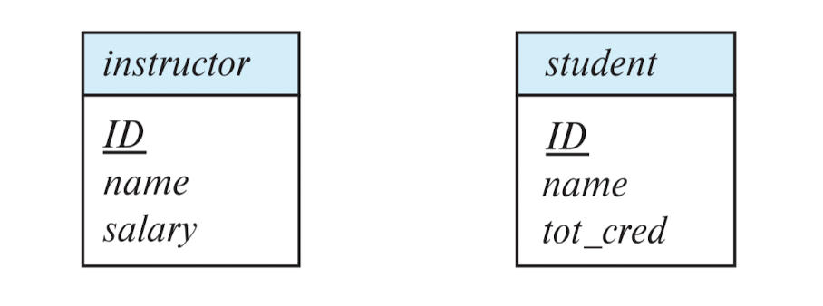
엔터티는 시스템 내에서 개별적으로 식별할 수 있는 무언가를 나타낸다. 일반적으로는 실제 세계의 사물 또는 개념을 나타낸다. 예를 들어, `학생`, `교수`, `과목`, `강의` 등이 엔터티가 될 수 있다.

보통 직사각형으로 엔터티 세트를 표현한다. 또한, 밑줄을 통해 기본키를 나타낸다.

## 2) 속성(Attribute):
엔터티의 특징이나 속성을 나타낸다. 예를 들어, 학생 엔터티의 속성으로는 `학번`, `이름`, `학과` 등이 있을 수 있다.

## 3) 관계(Relationship):
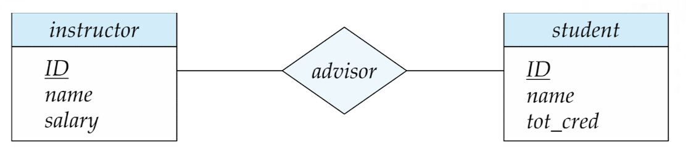
엔터티 간의 연관성이나 연결을 나타낸다. 관계에는 `일대일`, `일대다`, `다대다` 등의 다양한 형태가 있다. 예를 들어, `학생과` `강의` 간에는 `수강`이라는 관계가 있을 수 있다.

다이아몬드 도형으로 관계 세트를 나타낸다.

# ✅ 3. 연관관계
> 엔터티 간 연관관계를 나타내는 방법은 다양하다. 
> - 일대일: OneToOne
> - 일대다: OneToMany
> - 다대일: ManyToOne
> - 다대다: ManyToMany

## 1) 일대일 (OneToOne):
- 일대일 관계는 한 객체가 다른 객체와 정확히 하나의 관계를 가지는 경우를 나타낸다.
- 예를 들어, 한 명의 사람(Person)이 하나의 운전면허(License)를 가지는 경우가 일대일 관계이다.
- 일대일 관계는 양쪽 방향으로 정의될 수 있으며, 각 객체는 상대 객체에 대한 참조를 가질 수 있다.

## 2) 일대다 (OneToMany):
- 일대다 관계는 한 객체가 다른 객체들과 여러 개의 관계를 가지는 경우를 나타낸다.
- 예를 들어, 한 회사(Company)가 여러 명의 직원(Employee)을 가지는 경우가 일대다 관계이다.
- 일대다 관계는 한 객체가 다수의 다른 객체들을 참조할 수 있지만, 참조되는 객체는 오직 한 객체만 참조된다.

## 3) 다대일 (ManyToOne):
- 다대일 관계는 다수의 객체들이 하나의 객체를 참조하는 경우를 나타낸다.
- 예를 들어, 여러 명의 학생(Student)이 하나의 학교(School)에 속하는 경우가 다대일 관계이다.
- 다대일 관계는 여러 객체가 하나의 객체를 참조할 수 있지만, 참조되는 객체는 오직 한 객체만 참조된다.

## 4) 다대다 (ManyToMany):
- 다대다 관계는 다수의 객체들이 서로 다수의 객체들과 관계를 맺는 경우를 나타낸다.
- 예를 들어, 학생(Student)들이 다수의 강의(Class)를 수강하고, 각 강의에는 다수의 학생이 수강하는 경우가 다대다 관계이다.
- 다대다 관계는 두 객체 간에 서로 많은 관계가 존재하는 경우를 나타내며, 중간 테이블이나 객체를 통해 이를 해결해야 한다.

# ✅ 4. 정규화
> 정규화는 데이터베이스 설계에서 중복을 최소화하고 데이터의 일관성과 무결성을 유지하기 위해 사용된다. 주로 엔터티 간의 중복 데이터를 줄이고, 데이터 이상 현상을 방지하기 위해 적용된다. 관계형 데이터베이스 설계에서는 주로 제 1정규화, 제 2정규화, 제 3정규화, Boyce-Codd 정규화 등이 사용된다.

## 1) 정규형 종류
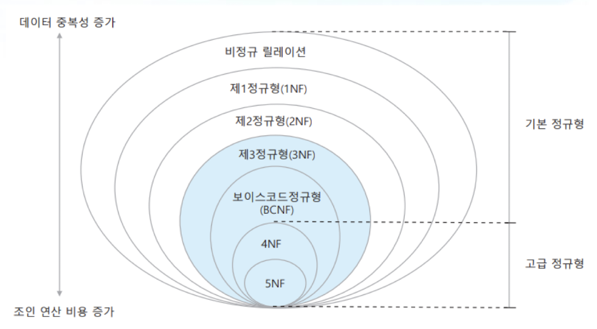

## 2) 정규형
- 정규화 과정에서 관계가 만족해야 하는 특정한 함수 종속성의 충족 조건
    - 특정 정규형이 요구하는 충족 조건을 관계가 만족하면 해당 수준의 정규형을 충족함을 의미한다.
- 제 3정규형 이상의 정규형을 충족하면 충분한 정규화가 이루어졌다고 본다. 
    - 보통 제 3정규형 또는 보이스-코드 정규형까지만 정규화를 진행한다.

## 3) 제 1정규형 (1NF)
### 정의
관계 R에 속한 모든 속성의 도메인이 원자값을 갖는 경우에, 관계 R은 제 1정규형이라 한다.

### 비정규 관계를 제 1정규형 관계로 정규화하는 방법
- n개의 다중값을 갖는 속성을 n개의 속성으로 분리한다.
- 정규화 대상인 관계가 관계형 데이터 모델의 기본 원칙을 따르기만 한다면 제 1정규형에 속한다.

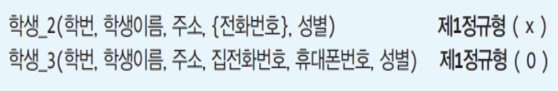

### 제 1정규형의 문제점
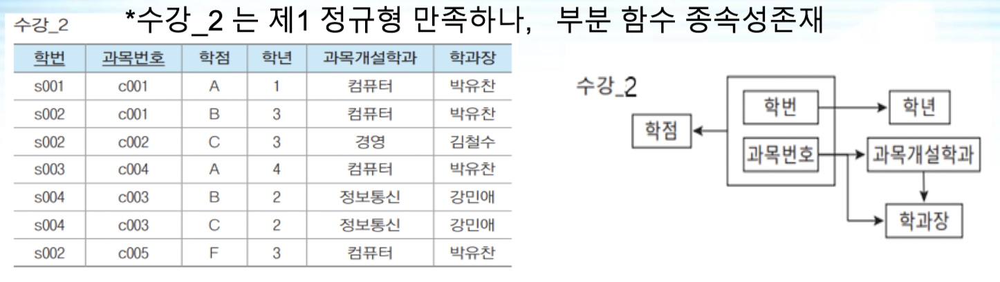

1. 삽입 이상
    - 과목 번호가 `c006`인 과목의 개설학과가 `통계학과`라는 사실만 따로 삽입할 수 없다.
2. 수정 이상
    - 컴퓨터학과의 학과장이 `박유찬`에서 `홍길동`으로 변경될 경우, 과목개설학과가 `컴퓨터`인 모든 튜플을 찾아 학과장 속성 값을 한꺼번에 `홍길동`으로 변경해야 함.
3. 삭제 이상
    - 만약, 학번 `s002` 학생이 과목번호 `c002` 과목 수강을 취소하여 이 튜플을 삭제하면 `c002` 과목의 개설학과가 `경영학과`이고 학과장이 `김철수`라는 정보까지 데이터베이스에서 함께 삭제됨.

### 제 1정규형의 문제점을 해결하기 위해 정규화
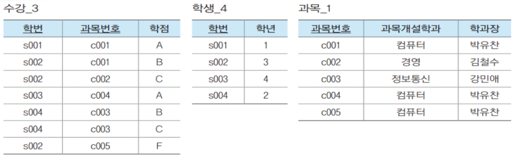

이로써 부분 함수 종속성이 사라지게 된다.

## 4) 제 2정규형 (2NF)
### 정의
관계 R이 제 1정규형이고, 기본 키에 해당하지 않는 모든 속성이 기본키에 완전 종속인 형태일 때, 이 관계 R을 제 2정규형이라 한다.

### 제 2정규형인지 점검하는 방법
- 제 2정규형은 제 1정규형을 충족하는 관계의 기본키가 복합 속성(속성이 2개 이상)일 때, 기본키의 일부 속성이 결정자인지(즉, 부분 함수 종속성이 있는지)를 검사한다.
- 만약 기본키가 단일 속성이면, 모든 속성이 완전 함수 종속이므로 검사할 필요가 없이 제 2정규형에 속한다.

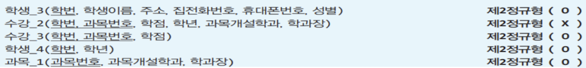

### 제 2정규형의 문제점
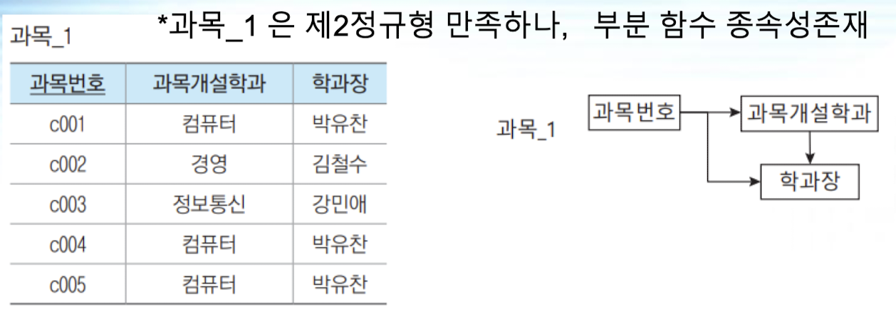

1. 삽입 이상
    - 과목 개설 학과인 `통계학과`의 학과장이 `홍장미`라는 사실만 따로 삽입할 수 없다.
2. 수정 이상
    - 컴퓨터학과의 학과장이 `박유찬`에서 `홍길동`으로 변경될 경우, 여전히 과목 개설 학과가 `컴퓨터`인 모든 튜플을 찾아 `학과장` 속성 값을 한꺼번에 `홍길동`으로 변경해야 한다.
3. 삭제 이상
    - 과목번호 `c002`의 등록을 취소하여 이 튜플을 삭제하면 `경영학과`의 학과장이 `김철수`라는 원하지 않은 정보까지 함께 삭제된다.

### 제 2정규형을 충족하는 데도 위와 같은 이상이 발생하는 이유
> 아직도 둘 이상의 의미적 연관성을 하나의 관계로 함께 표현했기 때문이다.

### 이행적 함수 종속성
- 기본키에 속하지 않은 일반 속성 값이 기본키에 속하지 않은 또 다른 일반 속성 값을 결정한다. 
- 해결방법: 이행적 종속 관계를 끊어 두 종속 관계를 각기 다른 관계에 표현한다. 즉, 2개의 관계로 분해한다.
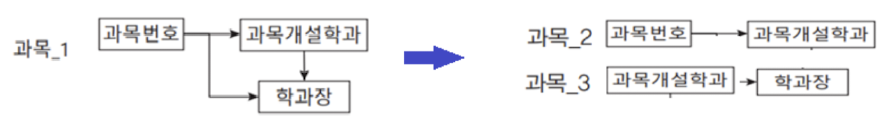
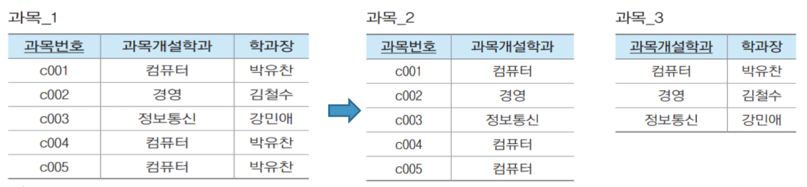

## 5) 제 3정규형 (3NF)
### 정의
어떤 관계 R이 제 2정규형이고, 기본 키에 속하지 않는 모든 속성이 기본키에 대해 이행적 종속이 아니면, 관계 R은 제 3정규형이다. 

### 제 3정규형 점검 방법
- 제 3정규형은 제 2정규형을 충족하는 관계의 기본키가 아닌 일반 속성이 결정자인지를 검사한다. 
- 일반 속성이 기본키 속성이 아닌 일반 속성에 종속적일 때 제 3정규형에 위배된다. 
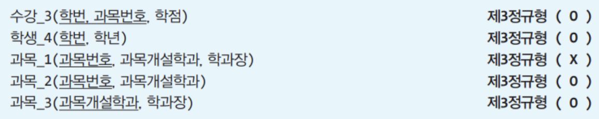

### 제 3정규형의 문제점
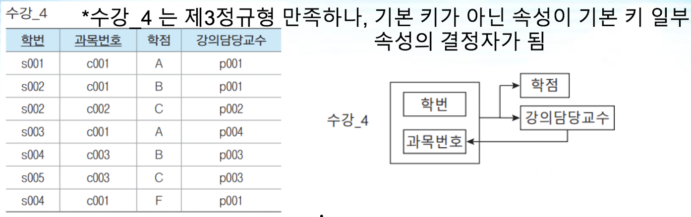

1. 삽입 이상
    - 과목번호 `c004`의 강의담당교수가 `p005`라는 사실만 따로 삽입할 수 없다.
2. 수정 이상
    - 강의담당교수 `p001`의 담당 과목번호가 `c005`로 변경될 경우, `p001`과 관련된 모든 튜플을 찾아 `과목번호` 속성 값을 한꺼번에 `c005`로 변경해야 한다.
3. 삭제 이상
    - 학번 `s002`인 학생이 교과번호 `c002`의 수강을 취소하여 이 튜플을 삭제하면 `p002` 교수가 `c002` 과목을 강의한다는 정보까지 함께 삭제된다.

이행 함수 종속성(Transitive Dependency)을 제거하여 모든 열이 기본 키에 이행적으로 종속되지 않아야 한다.

### 제 3정규형을 충족하는 데도 위와 같은 이상이 발생하는 이유
- 원인: 기본키가 아닌 속성이 기본키 일부 속성의 결정자가 되기 때문이다.
- 관계의 후보 키가 둘 이상이고 기본 키가 둘 이상의 조합일 때 발생한다.

### 제 3정규형의 문제점 해결
이러한 문제를 해결하려면 기본키가 아닌 결정자를 분리하여 2개의 관계로 분해해야 한다.
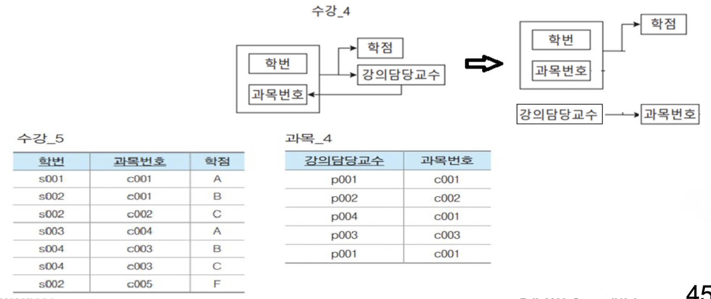

## 6) 보이스코드 정규형 (BCNF)
### 정의
- 복잡한 식별자 관계에 의한 문제를 해결하기 위해 제 3정규형을 보완한다.
- "강한 제 3정규형"이라고도 한다.
- 제 3정규형이더라도 기본키 속성이 기본키 속성이 아닌 일반 속성에 종속적일 때 보이스코드 정규형에 위배된다. 

### 보이스코드 정규형으로 변환
- 모든 결정자를 후보키로 만든다. 즉, 기본키가 아니면서 결정자 역할을 하는 속성과 그 결정자에 함수 종속이 되는 속성을 하나의 관계로 분리한다. 
- 이때, 결정자는 원 관계에도 남겨서 외래키 역할을 하도록 한다.

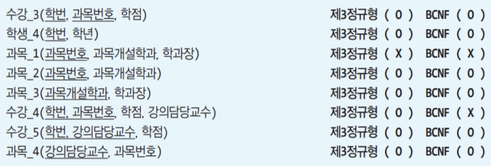

# ✅ 5. 반 정규화
> 반정규화는 성능 향상을 위해 데이터베이스의 정규화된 구조를 조정하여 중복을 증가시키는 과정이다. 주로 읽기 작업이 많고, 복잡한 조인 연산이 많은 경우에 사용된다. 반정규화를 통해 데이터의 읽기 속도를 높일 수 있지만, 쓰기 연산이 많은 환경에서는 주의해야 한다.

- 테이블 병합(Table Consolidation):
정규화된 테이블을 하나로 병합하여 조회 작업을 단순화하는 과정이다.
- 중복 추가(Adding Redundancy):
중복된 정보를 테이블에 추가하여 읽기 속도를 높이는 과정이다.
- 부분 집합 추가(Adding Subset):
여러 테이블에서 일부 열을 중복하여 추가하여 조회 작업을 간소화하는 과정이다.

