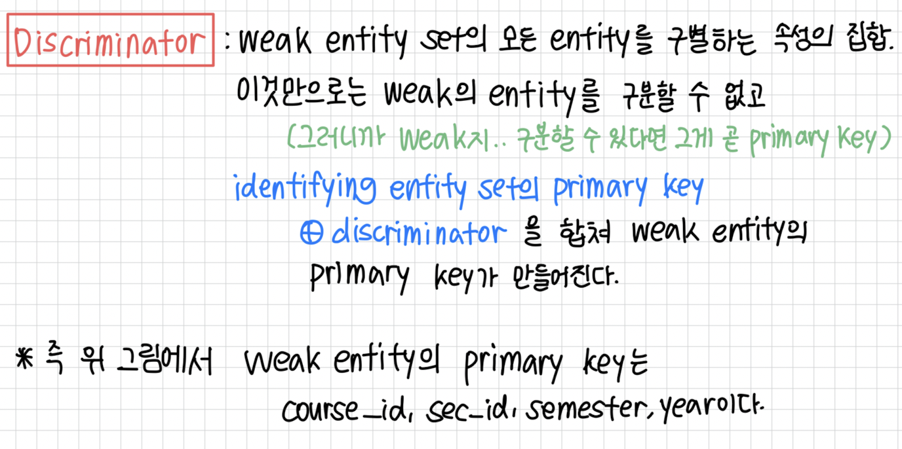
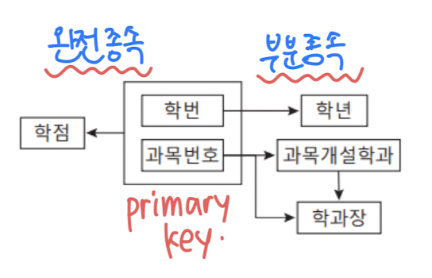

# 키워드 1. 외래 키

### Foreign key

---

- 테이블 간의 링크를 파괴하는 작업을 방지하는 데 사용된다.
- 외래 키는 다른 테이블의 기본키를 참조한다.
- table r1의 속성 A가 table r2 primary key로의 foreign key가 될 때,
    
**table r1은 `참조하는(referencing)` 관계이고, table r2는 `참조된(referenced)` 관계이다.**
    
- 외래 키가 있는 테이블을 `자식 테이블`이라고 하며,
    
    기본키가 있는 테이블을 `부모 테이블`이라고 한다.
    
    
    

### Foreign key 제약 조건

---

- 한 관계의 값은 다른 관계에 나타나야 함 (참조 관계)
- 해당 속성은 두 테이블에서 같은 값을 가진다.

**Foreign key는 다른 테이블의 Primary key를 가리킨다.**
여러 개의 테이블과 연결되어 있다면 foreign key는 여러개일 수 있음

# 키워드 2. 기본 키

### Primary key

---

- `슈퍼 키`: 테이블에서 유니크한 속성, 하나 또는 여러개의 조합이 가능
- `후보 키`: 슈퍼키에서 최소의 조합으로 이루어진 경우
- `기본 키`: 후보키 중 1개

### Primary key 제약 조건

---

- 테이블의 각 튜플(레코드)를 고유하게 식별한다.
- 기본키는 `UNIQUE`해야 하며 `NULL값`을 포함할 수 없다.
- 테이블에는 **기본 키가 ‘하나만’ 있을 수 있다.**
    - 이 기본 키는 단일 또는 다중 field로 구성될 수 있다.

# 키워드 3. ER 다이어그램

### E-R 모델 : entity set

---

- 엔터티 관계 모델
    - `Entity`: 다른 객체와 구별되는 사물 또는 개체, 속성의 집합으로 기술됨
    - `Relationship`: 여러 엔터티 관의 연관
- E-R 다이어그램으로 도식적으로 표현한다.

### E-R 모델 : Relationship set

---

- 마름모 모양으로 표현되며, 관계 집합을 나타낸다.
    
    
    

1. `명칭`을 가질 수 있다.
2. `차수`가 있다 (연결된 엔터티Set, 즉 테이블의 수)
3. 연결된 테이블의 속성 말고도, `자체적인 속성`을 가질 수 있다.

- 만약 Relationship set에 자체적 속성이 있다면 점선으로 표현한다.
    
    
    

### E-R 다이어그램 예제

---

- E-R 모델에서 엔터티 테이블과 관계 테이블을 나눠 표시한다.
- 후에 정규화 과정을 통해,
    
    1:n이나 1:1 관계의 경우 중복 제거하여 관계 테이블을 삭제할 수 있다.
    

# 키워드 4. 복합 키

### 속성 유형

---

- `단순` 및 `복합` 속성 : 독립적인 속성들이 모여서 만들어진 속성
- `단일 값` 및 `다중 값` 속성 : 하나의 속성에 값이 여러 개 들어가는 것
    - ex) 하나의 phone_numbers 속성의 여러 개의 전화번호 대입
- `파생` 속성 : 속성값이 다른 속성의 값에서 계산되어지는 것

### 복합 속성

---

- 복합 속성을 사용하면 속성을 하위 부분(다른 속성)으로 나눌 수 있다.
- ex) 상위 name 속성 - 하위 first_name 속성, last_name 속성

### E-R 다이어그램에서 복합 속성 표현

---

# 키워드 5. 연관 관계

>두 엔터티set는 `1:1 관계`, `1:다 관계`, `다:다` 관계를 가질 수 있으며,
>모든 엔터티가 적어도 하나의 관계에 참여해야 하는 `전체 참여`와
>일부 개체는 어떤 관계에도 참여하지 않아도 되는 `부분 참여`로 나뉜다.

- 엔터티 사이의 관계를 E-R 다이어그램에서 마름모 모양으로,
    
    Relationship Table을 만들어 표현한다.
    
- 이 Relationship Table은 다른 Entity Table들과 거의 같은 특징을 가진다.

### Relationship Set의 기본 키는?

---

1. 관계 테이블에서 고유한 Primary 키는 **두 엔터티의 primary key들의 합성**으로 이루어진다.
2. 즉, 관계 테이블의 속성은 `entity1의 PK`, `entity2의 PK` + 본인 고유 속성으로 이루어져 있단 것
3. 이때 1:1, 1:다, 다:다 관계에 따라 **한 entity의 PK만을 사용할 수**도 있다.

💡 본래 relationship table은 연결된 entity set의 모든 속성을 가지고 있고, 중복되는 것은 삭제해서 최종 관계테이블의 속성을 만든다.

- 다:다 관계인 경우
    
    : 관계table의 속성은 두 entity의 primary key + 고유 속성
    
    즉, PK는 각 entity table의 PK의 합집합이다. (둘 다 필요)
    
- 1:다/다:1 관계인 경우
    
    : 이때 Relationship table의 Primary key는 `다수 쪽`에 있는 것을 선택
    
- 1:1 관계인 경우
    
    : 이때 Relationship table의 Primary key는 `둘 중 아무거나` 하나를 골라 선택.

# 키워드 추가. weak entity / strong entity

# 키워드 추가. E-R 다이어그램에서 중복성 제거

### 중복성 제거

---

- 각 테이블에서 중복되는 속성 중에, 만약 한 속성이 다른 테이블의 PK 속성과 중복된다면 해당 속성을 제거한다.
- 이는 관계 테이블을 통해 해당 속성을 찾아갈 수 있어서인데,
이 방법은 E-R 다이어그램에 한정되고,
    
**E-R 다이어그램을 나중에 테이블로 변환 시 -> 1:다/1:1 관계에 따라 관계 테이블이 사라진다면 지워졌던 해당 속성은 부활하게 된다.**
    

- 나중에 마름모 모양 관계들을 제거하게 되는데 (1:1, 1:다, 다:1의 경우 제거 가능)
    
    제거되면 다시 이 속성이 foreign key로써 살아난다.

# 키워드 6. 정규화

### 정규화

---

- 데이터 이상 방지를 위해 중복을 감소시키는 구조로,
    
    단계적 규칙에 따라 relation을 분해하는 과정
    
- 정규화 과정에서 이상 문제(삽입 이상, 갱신 이상, 삭제 이상) 를 해결하려면
    
    연관성이 높은 속성들로만 릴레이션을 구성해야 함
    

그렇다면 왜 이런 이상들이 일어날까?

이는 속성 사이의 많은 연관 관계를 무리하게 하나의 릴레이션으로 표현할 때 발생한다.

이를 방지하려면 속성 사이의 연관관계, 즉 종속성을 분석하여

**하나의 릴레이션에는 하나의 종속성만 표현되도록 릴레이션을 분해**하면 된다!

기본적으로 연관성이 높은 속성들을 하나의 릴레이션으로 구성하는 것이 바람직.

- 릴레이션 속성 사이의 **연관성을 평가하기 위한 척도**가 필요 → `함수 종속성`

- 정규형이란, 정규화 과정에서 릴레이션이 만족해야 하는
    
    특정한 함수 종속성의 충족 조건
    
- `제3정규형` 이상의 정규형을 충족하면 충분한 정규화가 이루어졌다고 봄
    - 정규화를 너무 많이하면, 테이블이 너무 많이 쪼개져서 join 연산을 많이 해야한다.

### 함수 종속성

---

- 같은 릴레이션 안의 속성 간에 특정 속성값이 다른 속성값을 결정하는 종속 관계
    
    
    
- 속성1(결정자) → 속성2(종속자)로 표기
    - ex) 학번 → (이름, 주소, 학년, 성별)

### 완전 함수 종속과 부분 함수 종속

---

- `완전 함수 종속`
    - 결정자 속성 모두의 조합에만 종속되고, 모든 조합이 아니라면 종속성을 띄지 않는다.
    - 결정자가 단일 속성이면 당연히 완전 함수 종속
- `부분 함수 종속`
    - 결정자 속성이 2개 이상일 때, 결정자의 전체 속성 조합에도 함수 종속이면서
        
        결정자의 일부 속성에도 종속성을 가질 때
        

### 제1정규형

---

> 제1정규형 : 어떤 릴레이션 R에 속한 몯느 속성의 도메인이 원자 값(atomic value)만을 
> 갖는다면 제1정규형에 속한다.

- 즉, 다중 값을 가지지 않고 관계형 데이터 모델의 기본 원칙을 따르기만 한다면 당연히 제1정규형에 속함

- 제1정규형의 형태
    
    
    

### 제2정규형

---

- 제2정규형으로 넘어가려면, 테이블을 분해해야 함.

> 제2정규형 : 어떤 릴레이션 R이 제1정규형이고 기본키에 속하지 않는 모든 속성이 
> 기본키에 완전 함수 종속이면 제2정규형에 속한다.

→ 즉, **모두 완전함수종속이 되도록 분해!**

- 만약, 기본키가 단일 속성이면 모든 속성이 완전 함수 종속이므로 검사할 필요 없이 제2정규형에 속한다.

- 제2정규형의 형태
    
    
    
- 하지만, 아직도 `이행적 함수 종속성`이 남아 있음
    - 이행적 함수 종속성: 기본키에 속하지 않은 일반 속성 값이
        
        → 기본키에 속하지 않은 또다른 일반 속성값을 결정함
        
    - 위 그림의 과목_1 부분에서 오른쪽 연결과 같은 종속 형태가 나타난다
        
        
        
    
    - 제3정규화에서, 왼쪽 두 개의 표처럼
    이행적 종속 관계를 끊어 두 종속 관계를 각기 다른 릴레이션에 표현해야 한다.
    - 즉, 제3정규화에서 2개의 릴레이션으로 분해해야 함

### 제3정규형

---

> 제3정규형 : 어떤 릴레이션 R이 제2정규형이고 기본키에 속하지 않는 모든 속성이 
> 기본키에 이행적 함수 종속이 아니면, 제3정규형에 속한다.

- 일반 속성이 기본키 속성이 아닌 일반 속성에 종속적일 때 제3정규형에 위배됨
- 만약 결정자라면 테이블을 분해한다.

### 정규화의 적용

---

- 릴레이션을 정보 표현 측면에서 동등하면서도 중복을 감소시키는 더욱 작은 릴레이션들로 무손실 분해함으로써 이상 현상을 제거하는 DB설계의 한 방법

 

 
 # 키워드 7. 반 정규화

 ### 반정규화

---

- 정규화의 반대 개념, ‘역정규화’
    - 정규화와는 반대로 보다 낮은 수준의 정규형으로 릴레잇녀을 통합
    - 성능 저하가 문제될 경우 분해된 릴레이션을 역으로 통합, 성능을 향상시킴.
- 높은 정규형을 만족하는 릴레이션 스키마가 반드시 최적이라고 할 수 없다.
    - 릴레이션 수가 과다하게 늘어나면 조인 연산 등으로 시간이 오래 걸릴 수 있다.
- 따라서, 역으로 **데이터 중복을 허용하는 반정규화**를 수행 가능하다.

- 반정규화는 다음과 같은 과정을 포함한다.
    - 릴레이션 병합
    - 통계/이력 릴레이션을 추가
    - 여러 릴레이션에 같은 속성을 중복하여 추가
    - 총계/평균 같은 파생 속성을 추가

- 반정규화는 데이터베이스 설계의 최종 과정에서 신중하게 고려하기 !!
