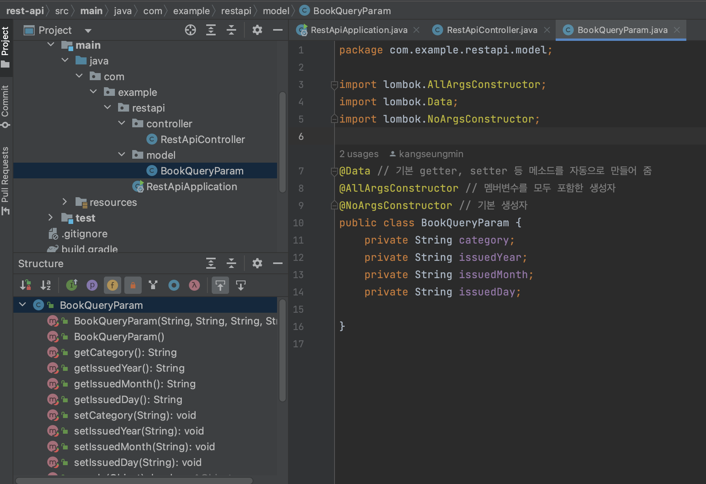

# Chapter 8. API 응답 통일 & 에러 핸들러

> UMC 워크북 8주차 키워드에 관한 내용을 정리해보겠습니다 :)


# ✅ 1. 의존성 주입이란?

<aside>
📋 의존성 주입은 객체를 다른 객체에 전달하는 기술이다.

</aside>

의존성 주입을 하면, 직접 의존성을 생성하는 대신 외부에서 주입받아 사용하게 되므로, 객체 생성과 사용을 분리하여 느슨한 결합을 촉진하고 시스템을 모듈화할 수 있다.

## 의존성 주입 유형 3가지

1. 생성자 주입
2. Setter 주입
3. 필드 주입

## 1. 생성자 주입

```java
public class Service {
    private final Repository repository;

    @Autowired
    public Service(Repository repository) {
        this.repository = repository;
    }

    public void doSomething() {
        repository.doSomething();
    }
}
```

→ 의존성이 생성자를 통해 제공된다.

생성자 주입을 하면 인스턴스가 생성될 때 1회 호출되는 것이 보장된다. 또한, repository 필드를 final로 정의하면 객체를 변경할 수 없게 만들어준다. 이는 순환 참조를 막아준다.

스프링에서는 생성자 주입 방식을 권장하고 있다!

## 2. Setter 주입

```java
public class Service {
    private Repository repository;

    @Autowired
    public void setRepository(Repository repository) {
        this.repository = repository;
    }

    public void doSomething() {
        repository.doSomething();
    }
}
```

→ 의존성이 Setter를 통해 주입된다.

이렇게 하면, 일단 객체를 생성해 두고 이후에 종속성을 필요한 경우에 따라 변경할 수 있다. 하지만, 필수 종속성이 설정되지 않은 경우에 객체가 불완전한 상태가 될 수 있다.

## 3. 필드 주입

```java
public class Service {
    @Autowired
    private Repository repository;

    public void doSomething() {
        repository.doSomething();
    }
}
```

→ 의존성이 필드에 직접 주입된다.

이렇게 하면, 코드가 단순해지고 가독성이 좋아진다. 하지만, 종속성을 주입하려면 리플렉션이나 DI 컨테이너가 필요해서 테스트하기 어려워진다.

또한, 필드가 이후에 변경될 수 있으므로 불변성을 만족하지 못한다.


# ✅ 2. IoC


📋 IoC는 Inversion of Control의 약자이다. 직역하면, 제어의 역전이다. **객체의 생성, 생명주기 관리 등에 대한 객체의 제어권이 바뀌었다는 것을 의미한다.**


## IoC 컨테이너

<aside>
📋 컨테이너는 객체의 생명주기를 관리하고, 생성된 인스턴스들에게 추가 기능을 제공한다.

</aside>

스프링에서도 IoC 컨테이너를 통해 객체를 관리하고 있다!

이렇게 하면, 객체 관리의 주체가 컨테이너가 되기 때문에 **개발자는 핵심 로직에만 집중**할 수 있는 장점이 있다!

- IoC 컨테이너는 객체의 생성과 의존성을 관리한다.
- 개발자는 비즈니스 로직에 집중할 수 이싿.
- 객체를 컨테이너로부터 주입받기 때문에 테스트가 용이하다.
- 컨테이너는 POJO에 대한 권한을 가진다.

📋 **POJO란?**

  Plain Old Java Object로, 특별한 Java 규칙이나 프레임워크를 따르지 않는 간단한 Java 객체이다. 예를 들면 getter, setter, toString만이 존재하는 클래스가 있다.

# ✅ 3. RestControllerAdvice

## `@ControllerAdvice`란?

<aside>
📋 스프링 애플리케이션에서 모든 컨트롤러에서 발생한 예외를 처리하는 데 사용된다.

</aside>

`@ControllerAdvice`는 REST와 비 REST 형식 모두 예외처리를 한다. 기본적으로 응답을 JSON이나 REST API에 적합한 형식으로 변환하지 않기 때문에, RESTful 서비스의 경우 응답을 직렬화하려면, 메소드에 `@ResponseBody`를 추가해야 한다.

## `@RestControllerAdvice`란?

📋 `@RestController` 어노테이션이 붙은 컨트롤러에서 발생하는 예외를 AOP를 적용하여 전역적으로 처리할 수 있는 어노테이션이다.


위의 `@ControllerAdvice`와 `@ResponseBody`의 기능을 결합한 것으로, 응답이 JSON 형식으로 반환된다.

```java
import org.springframework.http.HttpStatus;
import org.springframework.http.ResponseEntity;
import org.springframework.web.bind.annotation.ExceptionHandler;
import org.springframework.web.bind.annotation.RestControllerAdvice;

@RestControllerAdvice
public class GlobalExceptionHandler {

		// ResourceNotFoundException 예외에 대한 예외처리
    @ExceptionHandler(ResourceNotFoundException.class)
    public ResponseEntity<String> handleResourceNotFoundException(ResourceNotFoundException ex) {
        return new ResponseEntity<>(ex.getMessage(), HttpStatus.NOT_FOUND);
    }

		// Exception 예외에 대한 예외처리
    @ExceptionHandler(Exception.class)
    public ResponseEntity<String> handleGenericException(Exception ex) {
        return new ResponseEntity<>("An unexpected error occurred: " + ex.getMessage(), HttpStatus.INTERNAL_SERVER_ERROR);
    }
}
```

위 코드처럼 `@ExceptionHandler` 를 통해 특정 예외를 처리하도록 설정할 수 있다. 여러 예외를 처리하려면 클래스 배열을 사용할 수도 있다.

```java
@RestControllerAdvice(basePackages = "com.example.controllers")
public class SpecificExceptionHandler {
    // 예외 처리
}

@RestControllerAdvice(assignableTypes = {ControllerA.class, ControllerB.class})
public class SpecificExceptionHandler {
    // 예외 처리
}
```

또, `@RestControllerAdvice` 는 특정 패키지만을 탐지하도록 범위를 지정하거나 특정 컨트롤러 클래스를 탐지하도록 범위를 설정할 수도 있다.


# ✅ 4. Lombok

<aside>
📋 어노테이션을 통해 기본적인 동작을 하는 코드를 자동완성해주는 기능을 제공해주는 라이브러리이다.

</aside>


  예를 들면,

  

  클래스에 `@Data` 어노테이션을 달면, getter, setter, toString, … 등의 메소드가 내재적으로 제공된다. 이 외에도 `@AllArgsContructor` 를 통해 모든 멤버변수를 포함한 생성자를 제공받을 수 있으며, `@NoArgsConstructor` 를 통해 기본 생성자를 제공받을 수 있다.

  위 그림에서 구조를 살펴보면, `@Data` 어노테이션으로 인해 category 멤버변수를 가져오는 getCategory()라는 camel case의 getter 메소드를 제공받고 있는 모습을 확인할 수 있다.

  Lombok을 사용하면, 반복되는 코드 작성을 줄이고 코드를 깔끔하게 작성할 수 있는 장점이 있다!

  이 외에도 다양한 어노테이션이 존재한다.

  | 주석 | 목적 |
  | --- | --- |
  | @Getter | 모든 필드에 대한 getter 메소드를 생성 |
  | @Setter | 모든 필드에 대한 setter 메소드를 생성 |
  | @ToString | 'toString' 메서드를 생성 |
  | @EqualsAndHashCode | equals 및 hashCode 메소드를 생성 |
  | @NoArgsConstructor | 인수가 없는 생성자를 생성 |
  | @RequiredArgsConstructor | 필수 인수(최종 필드 또는 제약 조건이 있는 필드)가 있는 생성자를 생성 |
  | @AllArgsConstructor | 각 필드에 대해 하나의 인수를 사용하여 생성자를 생성 |
  | @Data | @Getter, @Setter, @ToString, @EqualsAndHashCode 및 @RequiredArgsConstructor의 약어 |
  | @Value | getter, 생성자, 적절한 equals 및 hashCode 메서드를 사용하여 변경할 수 없는 클래스를 생성 |
  | @Builder | 객체 생성을 위한 빌더 패턴을 구현 |
  | @SneakyThrows | 메서드 시그니처에서 선언하지 않고 확인된 예외가 발생하도록 허용 |
  | @NonNull | 메서드 실행 전에 필드가 null이 아닌지 확인하고 null인 경우 NullPointerException을 발생 |
  | @Cleanup | 지정된 리소스가 자동으로 정리(닫힘)되는지 확인 |
  | @Synchronized | synchronized 키워드와 유사하지만 특정 함정을 방지하는 동기화된 블록을 제공 |
  | @With | 수정된 값으로 새 인스턴스를 생성하는 "with" 메서드를 생성 |
  | @Log | 로거 필드를 생성(다음의 적절한 로거 사용: @CommonsLog, @Log4j, @Log4j2, @Slf4j, @XSlf4j, @JBossLog, @Flogger)  |
  | @Delegate | 다른 필드에 메서드를 위임 |
  | @Accessors | 필드에 대해 생성된 getter 및 setter를 구성 |
  | @FieldDefaults | 기본 액세스 수준을 수정하여 기본적으로 필드를 'private' 및 'final'로 변경 |