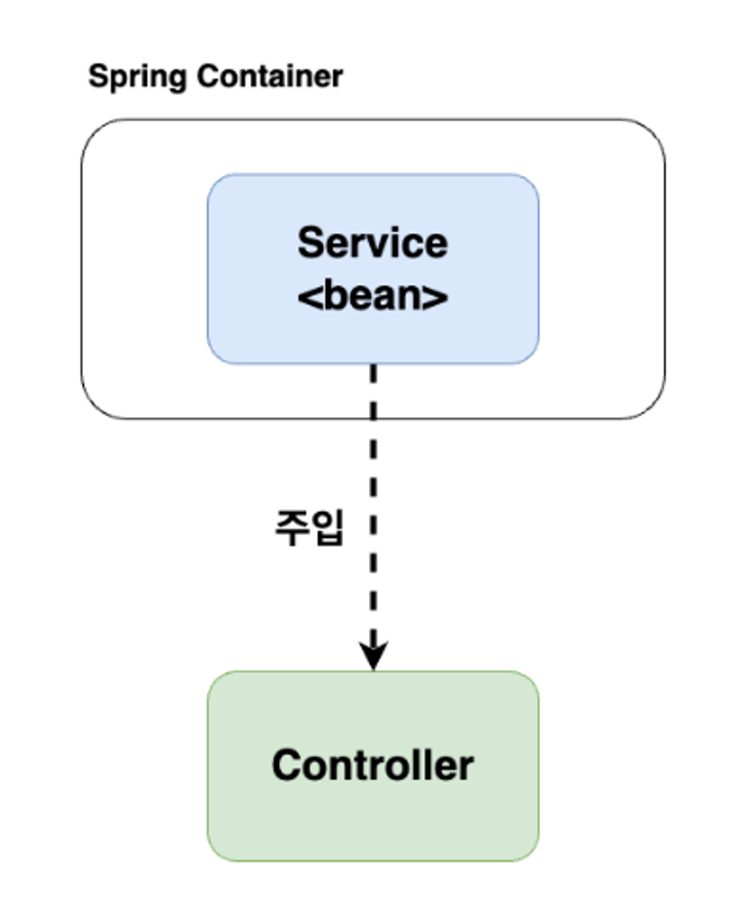

# keyword 1 : spring의 의존성 주입

### 의존성 주입 (DI)

---

> 어떤 객체가 사용하는 의존 객체를 `new` 연산자로 직접 만들어 사용하는 것이 아니라,
> 주입 받아서 사용하는 방법
> ex) 장난감들은 배터리에 의존하고 있다. 의존성 주입 → 배터리를 넣어주는 것

- 의존성 예시
    
    ```java
    import org.springframework.stereotype.Service;
    
    @Service
    public class BookService {
    
        private BookRepository bookRepository;
    
        public BookService(BookRepository bookRepository) {
            this.bookRepository = bookRepository;
        }
    }
    ```
    
    ```java
    @Service
    public class BookRepository {
          // DI Test
    }
    ```
    
    - **BookService 클래스는 BookRepository 클래스의 의존성을 가진다.**

- 강한 결합: 객체 내부에서 다른 객체를 직접 생성
- 느슨한 결합: 외부에서 생성된 객체를 인터페이스를 통해 넘겨받는 것
    - 결합도를 낮출 수 있고, 런타임시에 의존관계가 결정되기 때문에 유연하다.

### Spring의 의존성

---

- 의존을 주입하는 코드를 개발자가 직접 구현하면 객체간 결합도가 증가할 수 있다.
    
    스프링 프레임워크 존재 이유는 여기에 있다.
    
- Spring은 `컨테이너`라는 객체를 저장하는 공간이 있다.
    
    컨테이너에 저장된 객체를 `Bean`이라고 부른다.
    
    많은 객체가 의존하는 객체는 Bean으로 등록하고 필요할 때마다 컨테이너에서 빼온다.
    
- 컨테이너에 등록하는 방법
    
    : Bean으로 만들고 싶은 객체를 어노테이션으로 표시한다. (`@Component`, `@Bean` ) 
    
    스프링 프레임워크는 어노테이션을 스캔하여 Bean으로 등록한다.
    



컨테이너에 Bean이 등록되면 Bean에 의존하는 객체에 주입해야 한다.

이때 주입하는 방법은 아래 3가지가 있다.

### 의존성 주입 방식

---

1. 필드 주입 (`@Autowired`)
    - 클래스에 선언된 필드에 생성된 객체를 주입
    - 주입할  필드 위에 @Autowired 어노테이션 사용
        
        ```java
        @Controller
        public class PetController{
        	@Autowired
          private PetService petService;
        }
        ```
        
2. 수정자 주입
    - 클래스의 수정자를 통해 의존성 주입
        
        ```java
        @Controller
        public class PetController{
        
            private PetService petService;
        
        		@Autowired
            public void setPetService(PetService petService){
            	this.petService = petService;
           }
        }
        ```
        
3. 생성자 주입
    - 클래스의 생성자를 통해 의존성 주입
    - 생성자 주입은 인스턴스가 생성될 때 1회 호출되는 것이 보장
    - 생성자 주입시 필드에 final 키워드를 사용할 수 있음
        
        ```java
        @Controller
        public class PetController{
        
            private final PetService petService;
        
        		@Autowired
            public PetController(PetService petService){
            	this.petService = petService;
            }
        }
        ```
        
    
    - 클래스 주입시에는 아래의 두 특징과 `Lombok` 라이브러리를 통해 더 간편하게 작성
        
        ✅ 클래스 내 생성자가 한개
        
        ✅ 주입받을 객체가 Bean으로 등록
        
        ```java
        @Controller
        @RequiredArgsConstructor
        public class PetController{
            private final PetService petService;
        }
        ```
        
    - `@RequiredArgsConstructor` 로 필드를 포함한 생성자를 포함시켜주고 `@Autowired` 키워드를 생략해서 더 가독성이 좋은 코드로 사용 가능

### 생성자 주입 방식의 장점

---

1. `객체의 불변성` → 생성자를 통해 최초 1회만 주입하므로 불변 객체를 보장
2. 순환 참조 문제 방지
3. 테스트 용이


# keyword 2 : IoC 컨테이너

### IoC (Inversion of Control) : 제어의 역전

---

> 제어가 역전된 상태:
> 라이브러리를 사용할때는 개발자가 라이브러리를 호출해서 사용하지만, 프레임워크에서는 요청을 받았을 때 개발자가 개발해놓은 코드를 프레임워크가 호출하여 사용한다.
> 
> 이때 `개발자 -> 코드(라이브러리)`에서 `코드(프레임워크) -> 개발자`로 호출의 주체가 바뀌게 되고 이것을 제어의 역전이라고 한다.

### 자바와 스프링의 실행 순서

---

```
자바
1. 객체 생성
2. 의존성 객체 생성 (클래스 내부에서 생성)
3. 의존성 객체 메소드 호출

스프링
1. 객체 생성
2. 의존성 객체 주입 (스스로 만드는 것이 아니라, 제어권을 스프링에게 위임하여 스프링이 만들어 놓은 객체를 주입)
3. 의존성 객체 메소드 호출
```

따라서 스프링이 모든 의존성 객체를 스프링이 실행될 때 만들어주고 필요한 곳에 주입시켜줌으로써 `Bean`들은 싱글톤 패턴의 특징을 가지며, 제어의 흐름을 사용자가 컨트롤하는 것이 아니라 스프링에게 맡겨 작업을 처리하게 된다.

### IoC 컨테이너의 종류

---

1. `BeanFactory`
    - IoC 컨테이너의 기본이 되는 인터페이스
    - Bean을 관리하는 역할
2. `ApplicationContext`
    - BeanFactory를 상속받고 있기 때문에 BeanFactory와 같은 기능을 함
    - 또한 이외에도 다양한 클래스들을 상속받아 더 많은 기능을 제공
        - 텍스트 메시지 관리, 이벤트 발생 알림 등

# keyword 3 : RestControllerAdvice

< 애플리케이션 전역에서 발생하는 예외를 한 곳에서 관리 >

### @ControllerAdvice

---

- `@ExceptionHandler`, `@ModelAttribute`, `@InitBinder` 가 적용된 메서드들에
    
    AOP를 적용해 Controller 단에 적용하기 위해 고안된 어노테이션
    
- 모든 `@Controller`에 대한, 전역적으로 발생할 수 있는 예외를 잡아서 처리할 수 있다

### @RestControllerAdvice

---

- `@ControllerAdvice`와 `@ResponseBody`를 합쳐놓은 어노테이션
- `@ControllerAdvice`와 동일한 역할을 수행하고,
    
    추가적으로 `@ResponseBody`를 통해 객체를 리턴할 수도 있dma
    
- 따라서 단순히 예외만 처리하고 싶다면 → `@ControllerAdvice`
    
    응답으로 객체를 리턴해야 한다면 → `@RestControllerAdvice`를 적용
    

### 사용 예제

---

```java
@RestControllerAdvice
public class EditAdviser {

	@ExceptionHandler(Exception.class)
	public void exceptionHandler(Exception e) {
		System.out.println(e.getMessgae());
	}
}
```

- 위와 같이 어노테이션을 선언하면, 알아서 해당 예외를 `exceptionHandler()` 메서드에 정의된 로직으로 처리할 수 있음
- ExceptionHandler 함수는 `Exception.class`와 그 하위 클래스 예외를 특정적으로 처리

- 아래와 같이 Controller에서 예외처리를 따로 하지 않아도 됨
    
    ```java
    @GetMapping("/test")
    public ResponseEntity<String> exceptionHandlerTest() throws Exception {
    	return new ResponseEntity(test(), HttpStatus.OK);
    }
    ```

# keyword 4 : lombok

### Lombok

---

- 어노테이션 기반으로 코드 자동완성 기능을 제공하는 라이브러리
    - EX) Getter, Setter, ToString, Constructor(생성자)

- Lombok 장점
    1. 어노테이션을 통한 코드 생산성, 편의성 증가
    2. Code의 길이가 줄어들어 가독성, 유지보수성 향상
    3. Builder 패턴의 적용, Log 생성 등 편의성

### Lombok 기능

---

1. `@Getter`  / `@Setter`
    
    <aside>
    💡 클래스 이름 위에 적용시키면 모든 변수들에 적용 가능
    변수 이름 위에 적용시키면 해당 변수들만 적용 가능
    
    </aside>
    

2. `@AllArgsConstrucr`
    - 모든 변수를 사용하는 생성자를 자동완성시켜주는 어노테이션
    
3. `@NoArgsConstructor`
    - 어떤한 변수도 사용하지 않는 기본 생성자를 자동완성 시켜주는 어노테이션

4. `@RequiredArgsConstructor`
    - 특정 변수만을 활용하는 생성자를 자동완성 시켜주는 어노테이션
    - 생성자의 인자로 추가할 변수에 `@NonNull` 어노테이션을 붙여서
        
        해당 변수를 생성자의 인자로 추가할 수 있다.
        
    - 아니면 해당 변수를 final로 선언해도 의존성을 주입받을 수 있다.
    - 예제
        
        ```java
        @Getter
        @RequiredArgsConstructor
        public class Store extends Common {
        
            @NonNull
            private String companyName;                                 // 상호명
            private final String industryTypeCode;                      // 업종코드
            private String businessCodeName;                            // 업태명
            private String industryName;                                // 업종명(종목명)
        
            /* RequiredArgsConstructor 통해 아래의 생성자를 자동 생성할 수 있다.
            public Store(String companyName, String industryTypeCode) {
                this.companyName = companyName;
                this.industryTypeCode = industryTypeCode;
            }
            */
        
        }
        ```
        

5. `@Builder`
    - 해당 클래스의 객체의 생성에 Builder패턴을 적용시켜준다.