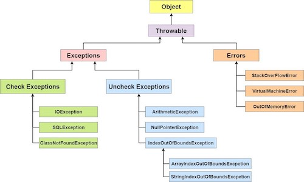

# Chapter 9. API & Swagger & Annotation

> UMC 워크북 9주차 키워드에 관한 내용을 정리해보겠습니다 :)

# ✅ 1. java의 Exception 종류들


> Java에서의 예외(Exception)는 Checked Exception과 Unchecked Exception 두 가지로 나누어 진다.

## 1) Checked Exception (체크 예외)

Checked Exception은 컴파일 시점에 반드시 처리(try-catch 블록을 통해 처리하거나 throws를 통해 상위 메서드로 전달)해야 하는 예외이다. 

**주로 외부 환경에 의존적인 작업**(예: 파일 입출력, 네트워크 통신)에서 발생한다.


- `IOException`: 입출력 작업 중 발생하는 예외.
- `SQLException`: 데이터베이스 작업 중 발생하는 예외.
- `ClassNotFoundException`: 클래스가 존재하지 않을 때 발생하는 예외.

## 2) Unchecked Exception (언체크 예외)

Unchecked Exception은 컴파일러가 예외 처리 여부를 강제하지 않는 예외로, 주로 프로그래밍 오류(버그)에 의해 발생한다. 

**런타임 시에 주로 발생한다.**

- `NullPointerException`: 객체 참조가 null인 상태에서 메서드나 필드에 접근할 때 발생하는 예외.
- `ArrayIndexOutOfBoundsException`: 배열의 인덱스가 범위를 벗어날 때 발생하는 예외.
- `IllegalArgumentException`: 메서드에 잘못된 인자가 전달될 때 발생하는 예외.

## 3) Error (예외 아님)
Java에서 `Error`는 일반적인 예외(Exception)와는 다르게 취급된다. 

Error는 보통 JVM(Java Virtual Machine) 자체의 에러를 나타내며, 애플리케이션에서 복구 불가능한 심각한 문제를 말하고, 
주로 시스템 레벨에서 발생하는 문제들로 인해 프로그램이 더 이상 정상적으로 실행될 수 없는 상황을 나타낸다.

- OutOfMemoryError
    - JVM이 더 이상 메모리를 할당할 수 없을 때 발생한다.
    - 대량의 객체를 생성하여 힙 메모리가 모두 사용된 경우.
    - 메모리 누수를 방지하고, 메모리 사용을 최적화하며, JVM 옵션을 통해 힙 메모리 크기를 조정한다. 


- StackOverflowError 
    - 너무 깊은 재귀 호출 등으로 인해 스택 메모리가 초과되었을 때 발생한다.
    - 무한 재귀 호출인 상황
    - 재귀 호출을 반복문으로 대체하거나 재귀 깊이를 제한한다. 


- VirtualMachineError
    - JVM이 실행을 계속할 수 없는 심각한 문제를 나타내는 에러의 상위 클래스이다.
    - OutOfMemoryError, StackOverflowError, InternalError, UnknownError 등이 있다.
    
- LinkageError
    - 클래스의 로딩이나 링크 중에 문제가 발생했을 때 던져진다.
    - ClassNotFoundError, NoClassDefFoundError, UnsatisfiedLinkError 등이 있다.

## 4) Error와 Exception의 차이점
- 처리 가능 여부: Exception은 대부분의 경우 catch 블록을 통해 복구할 수 있지만, Error는 시스템 수준의 문제를 나타내기 때문에 애플리케이션에서 복구하기 어렵다.
- 용도: Exception은 주로 애플리케이션 로직에서 발생하는 예외 상황을 나타내고, Error는 JVM의 문제를 나타낸다.

# ✅ 2. @Valid 어노테이션
> @Valid 어노테이션은 Java Bean Validation API(JSR-380, Bean Validation 2.0)의 일부로, 객체의 유효성을 검사할 때 사용된다. 스프링에서는 주로 요청 파라미터의 유효성을 검증할 때 사용한다.

## 1) DTO에 적용하는 법
```
import javax.validation.constraints.NotEmpty;
import javax.validation.constraints.Size;

public class UserDTO {

    @NotEmpty(message = "Name cannot be empty")
    @Size(min = 2, max = 30, message = "Name must be between 2 and 30 characters")
    private String name;

    @NotEmpty(message = "Email cannot be empty")
    private String email;

    // Getters and Setters
}

```

## 2) Controller에서 유효성 검사
```
import org.springframework.web.bind.annotation.*;
import javax.validation.Valid;

@RestController
public class UserController {

    @PostMapping("/users")
    public ResponseEntity<String> createUser(@Valid @RequestBody UserDTO userDTO) {
        // 유효성 검사가 성공적으로 통과되면 비즈니스 로직 수행
        return ResponseEntity.ok("User is valid");
    }
}

```

## 3) 유효성 검사 실패 시 처리하는 법
```
import org.springframework.http.HttpStatus;
import org.springframework.http.ResponseEntity;
import org.springframework.web.bind.MethodArgumentNotValidException;
import org.springframework.web.bind.annotation.ExceptionHandler;
import org.springframework.web.bind.annotation.RestControllerAdvice;
import java.util.HashMap;
import java.util.Map;

@RestControllerAdvice
public class GlobalExceptionHandler {

    @ExceptionHandler(MethodArgumentNotValidException.class)
    public ResponseEntity<Map<String, String>> handleValidationExceptions(MethodArgumentNotValidException ex) {
        Map<String, String> errors = new HashMap<>();
        ex.getBindingResult().getAllErrors().forEach((error) -> {
            String fieldName = ((FieldError) error).getField();
            String errorMessage = error.getDefaultMessage();
            errors.put(fieldName, errorMessage);
        });
        return new ResponseEntity<>(errors, HttpStatus.BAD_REQUEST);
    }
}

```

스프링 부트에서는 유효성 검사 실패 시 기본적으로 MethodArgumentNotValidException이 발생하며, 이를 @ExceptionHandler를 통해 처리할 수 있다.

