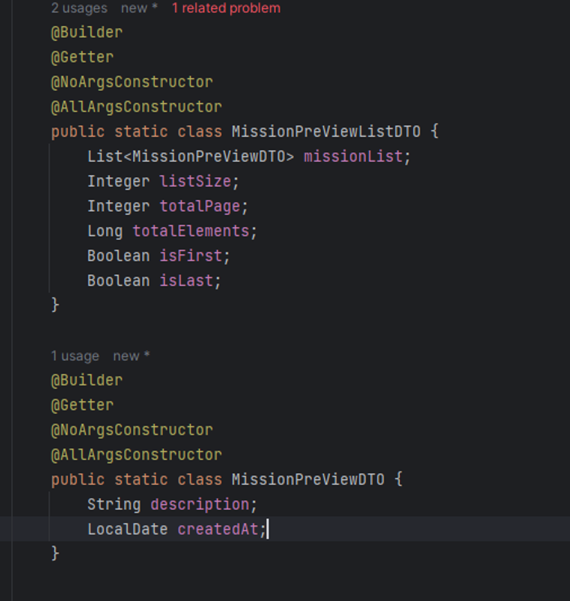

깃허브 링크: https://github.com/h-ye-ryoung/umc-practice/tree/mission10

# mission 1 : 내가 작성한 리뷰 목록 API

validator

레포지토리에 유저로 추가

서비스에서 유저id로 리뷰 찾기

파라미터로 UserId와 Page를 받아서 처리
page는 page-1로 설정

가게1 스웨거

성-공

페이지가 음수일 때

# mission 2 : 특정 가게의 미션 목록 API

미션 레포지토리에서 스토어에 따른 미션 findAll

서비스에서 특정 StoreId에 부합하는 모든 미션을 찾는 로직 구현

missionResponse DTO에 Builder 패턴으로 미션프리뷰와 그 리스트의 DTO 작성

Converter 작성

컨트롤러 작성
파라미터로 Store와 Page를 받을 때, @ExistsStores와 @CheckPage로 검증

요청

응답 성공

페이지 넘버 잘못됐을때

# mission 3 : 내가 진행중인 미션 목록 API

서비스 로직

UserMission 레포지토리

특정 유저가 진행중인 미션의 목록 (미션은 DB에 직접 넣었습니다)

성공

페이지 넘버가 음수일때
