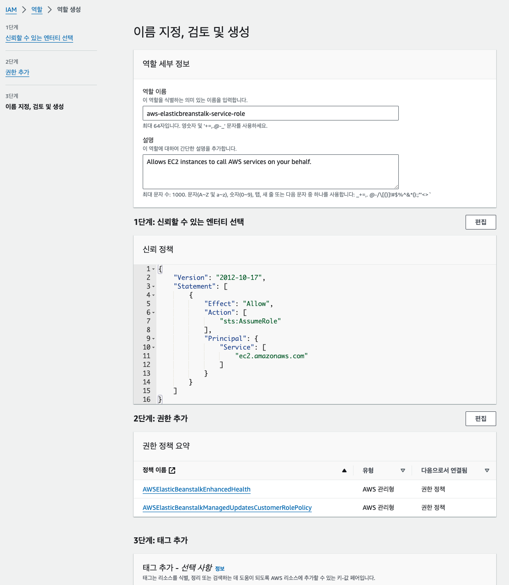
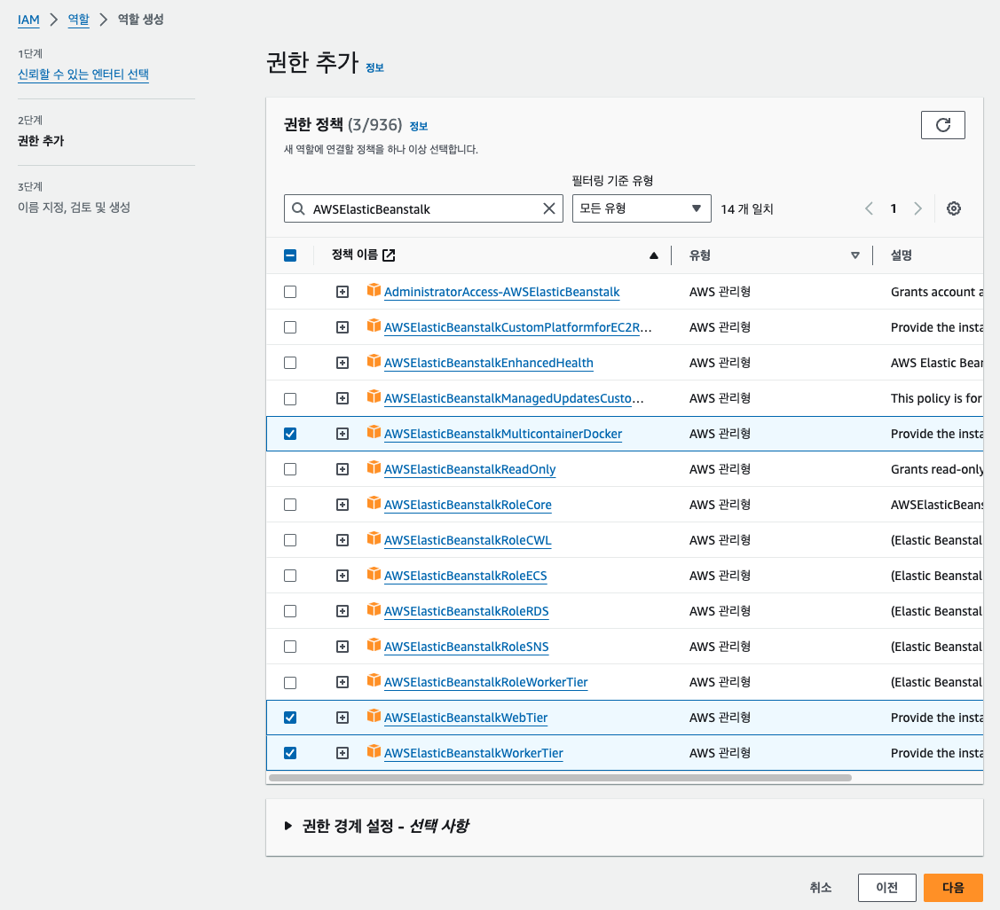
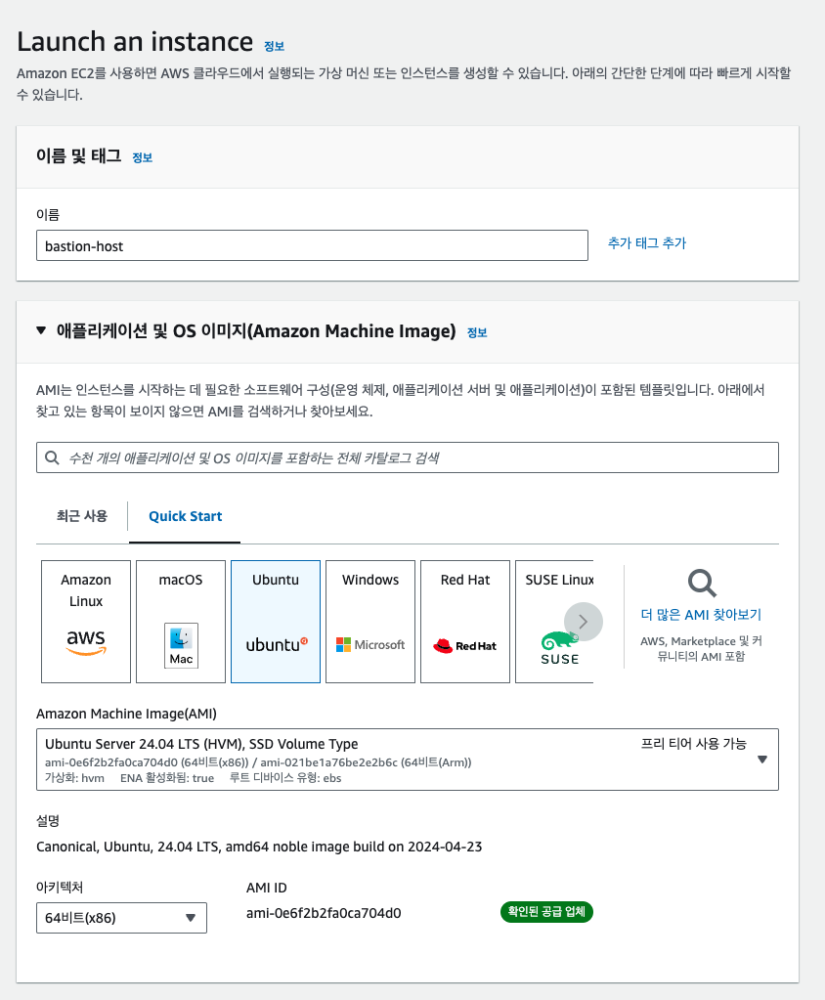

# 11주차 미션

# IAM 역할 생성

## ELB




→ 신뢰 정책에 elb가 없기 때문에 일단 이대로 만들고 따로 수정해야 됨 !


## EC2




# ELB 생성


→ 무중단 배포를 위해 사용자 지정 구성 선택 !


→ 퍼블릭 IP 주소 활성화 클릭 ! (ELB 만들 때 잘 만들어졌는지 확인을 하는데, 이때 EC2의 아이피 주소로 통신하기 때문)

→ 인스턴스 서브넷은 퍼블릭으로 2개 이상 선택. (하나가 안 될 때 다른 하나로 만들기 위해) 프라이빗과 퍼블릭을 각각 선택하면 AWS는 보안을 중요시하기 때문에 프라이빗으로 무조건 만듦. → 통신 불가

→ 나머지 아래는 그대로.


→ 오토 스케일링의 인스턴스 개수를 최소 1, 최대 2개로 설정해야 함. 최대값이 1개이면 중단 배포 !! 2개여야 무중단 배포가 가능함.


→ t3.small 제거


→ 프로세스 수정 (WAS 상태 확인을 위해 GET /health API 자동 실행) → 스프링으로 구현해놔야 함!!


→ 강화됨으로 선택해야 뭐 때문에 서버가 터졌는지 알려줌.


→ 무중단 배포를 위해 배포 정책 수정


→ 로드 밸런서가 어디로 보낼지 포트 번호 설정

# IAM 사용자 만들기


→ 사용자 생성

액세스 키 만들기


위에서 만든 액세스 키를 깃허브 환경변수에 추가해야 함. (그래야 스프링에서 환경변수로 가져다 쓸 수 있음) 이렇게 하면 깃 이그노어 필요 x


# Github Action 실행


→ 계속 빈스톡 디플로이 실패했는데 알고 보니 리전 문제였음 ㅋㅋ.

```yaml
region: ap-northeast-1
에서
region: ap-northeast-2
로 변경
```


하지만 뭔가 버그가 걸려서 nginx랑 스프링이 실행이 안 됨.


ELB 환경에 뭔가 에러가 잔뜩 ㄷㄷ

주석이랑 들여쓰기 등등이 잘못된 거였음.


이제 정상적으로 ec2가 2개가 생성됨.

좀만 기다리면..


드디어 스프링 실행 !


헬스 체크도 완벽

하지만 아직 로드 밸런서가 남았다..


ELB 환경에서 구성에 들어와서 여기에 들어옴

내려서 리스너 추가


이제 포트 번호 8080에 대해서도 스프링이 동작한다!


이후에 진행하는 HTTPS와 DNS 관련은 내가 도메인을 사지 않아서 못 했음.. ㅋㅋ

이제 RDS 만들기


개발용 서브넷 그룹 생성


마찬가지로 릴리즈(배포)용 서브넷 그룹 생성

그리고 데이터베이스 생성


프리티어로 하고, 마스터 이름과 암호 입력. 암호는 길게 !!


스토리지 자동 조정 끔 (돈 나감)


VPC, 퍼블릭 액세스, 보안그룹 설정


추가 구성에서 자동 백업 끄기 (돈 나감)


이렇게 생성을 눌렀는데 실패했다고 뜸.


알고 봤더니 VPC의 DNS 설정에서 호스트 이름 활성화를 클릭해야 함.

저거 하고 다시 생성했더니 됨 !

이제 릴리즈용 RDS도 위처럼 만든다 !


약간의 차이: 서브넷 그룹 릴리즈로. 퍼블릭 액세스 끔.


이제 생성될 동안 기다리면 됨.

아까 dev는 퍼블릭, release는 프라이빗으로 만들었음.

따라서, dev는 호스트로 바로 접속 가능. 하지만 release는 바로 접속 불가

접속하려면??

**베스쳔 터널링이라는 기술 필요**

퍼블릭 서버를 두고 프라이빗으로 포워딩하면 됨.

일단 퍼블릭 EC2 생성




이렇게 생성 !

생성이 완료되면,

SSH로 연결 후 다시 프라이빗 데이터베이스 호스트로 연결 테스트


→ SSH 연결 해주시고


→ 이제 다시 프라이빗 RDS (릴리즈용)에 연결하면 성공 !!


끗.

# 코드

### 00-makeFiles.config
```yaml
files:
  "/sbin/appstart":
    mode: "000755"
    owner: webapp
    group: webapp
    content: |
      # !/usr/bin/env bash
      JAR_PATH=/var/app/current/application.jar

      # run app
      killalljava
      java -Dfile.encoding=UTF-8 -jar $JAR_PATH
```


### 01-set-timezone.config
```yaml
commands:
  set_time_zone:
    command: ln -f -s /usr/share/zoneinfo/Asia/Seoul /etc/localtime
```

### dev_deploy.yml
```yaml
name: UMC Dev CI/CD

on: # 특정 브랜치에 머지되었을 때 CI/CD가 실행되도록
  pull_request:
    types: [closed]
  workflow_dispatch: # (2).수동 실행도 가능하도록

jobs:
  build:
    runs-on: ubuntu-latest # (3).OS환경
    if: github.event.pull_request.merged == true && github.event.pull_request.base.ref == 'develop' # develop 브랜치에 머지되었을 때 실행되도록 설정

    steps:
      - name: Checkout # 이름 아무거나 설정 가능.
        uses: actions/checkout@v2 # (4).코드 check out  깃허브의 actions/checkout@v2를 사용해서 체크아웃 (범위는 .github가 속한 상위의 모든 자식)

      - name: Set up JDK 17
        uses: actions/setup-java@v3
        with:
          java-version: 17 # (5).자바 설치
          distribution: 'adopt'

      - name: Grant execute permission for gradlew # gradlew에 빌드 권한 주기.
        run: chmod +x ./gradlew
        shell: bash # (6).권한 부여

      - name: Build with Gradle # 빌드
        run: ./gradlew clean build -x test
        shell: bash # (7).build시작

      - name: Get current time # 타임스탬프 찍기
        uses: 1466587594/get-current-time@v2
        id: current-time
        with:
          format: YYYY-MM-DDTHH-mm-ss
          utcOffset: "+09:00"# (8).build시점의 시간확보

      - name: Show Current Time
        run: echo "CurrentTime=$"
        shell: bash # (9).확보한 시간 보여주기

      - name: Generate deployment package # 빌드된 파일 배포 디렉토리에 복사 및 기타 설정
        run: |
          mkdir -p deploy
          cp build/libs/*.jar deploy/application.jar
          cp Procfile deploy/Procfile 
          cp -r .ebextensions-dev deploy/.ebextensions
          cp -r .platform deploy/.platform
          cd deploy && zip -r deploy.zip .
          

      - name: Beanstalk Deploy
        uses: einaregilsson/beanstalk-deploy@v20
        with:
          aws_access_key: ${{ secrets.AWS_ACTION_ACCESS_KEY_ID }} # 깃허브 환경변수에 추가 (AWS에서 IAM 사용자에 액세스 키 생성 후 복사)
          aws_secret_key: ${{ secrets.AWS_ACTION_SECRET_ACCESS_KEY }} # 깃허브 환경변수에 추가
          application_name: project-dev
          environment_name: Project-dev-env
          version_label: github-action-${{ steps.current-time.outputs.formattedTime }}
          region: ap-northeast-2
          deployment_package: deploy/deploy.zip
          wait_for_deployment: false

```


### client_max_body_size.conf
```yaml
client_max_body_size 200M;
```


### nginx_conf
```yaml
user                    nginx;
error_log               /var/log/nginx/error.log warn;
pid                     /var/run/nginx.pid;
worker_processes        auto;
worker_rlimit_nofile    33282;

events {
    use epoll;
    worker_connections  1024;
    multi_accept on;
}

http {
  include       /etc/nginx/mime.types;
  default_type  application/octet-stream;

  log_format  main  '$remote_addr - $remote_user [$time_local] "$request" '
                    '$status $body_bytes_sent "$http_referer" '
                    '"$http_user_agent" "$http_x_forwarded_for"';

  include       conf.d/*.conf;

  map $http_upgrade $connection_upgrade {
      default     "upgrade";
  }

  upstream springboot {
    server 127.0.0.1:8080;
    keepalive 1024;
  }

  server {
      listen        80 default_server;
      listen        [::]:80 default_server;

      location / {
;         리버스 프록시 설정
          proxy_pass          http://springboot;
;                   #  CORS 관련 헤더 추가
          add_header 'Access-Control-Allow-Origin' '*';
          add_header 'Access-Control-Allow-Methods' 'GET, POST, PUT, DELETE, OPTIONS';
          add_header 'Access-Control-Allow-Headers' 'Authorization, Content-Type';
          proxy_http_version  1.1;
          proxy_set_header    Connection          $connection_upgrade;
          proxy_set_header    Upgrade             $http_upgrade;

          proxy_set_header    Host                $host;
          proxy_set_header    X-Real-IP           $remote_addr;
          proxy_set_header    X-Forwarded-For     $proxy_add_x_forwarded_for;
      }

      access_log    /var/log/nginx/access.log main;

      client_header_timeout 60;
      client_body_timeout   60;
      keepalive_timeout     60;
      gzip                  off;
      gzip_comp_level       4;

      # Include the Elastic Beanstalk generated locations
      include conf.d/elasticbeanstalk/healthd.conf;
  }
}
```


### HealthController
```yaml
package com.example.beanstalk.controller;

import org.springframework.web.bind.annotation.GetMapping;
import org.springframework.web.bind.annotation.RestController;

@RestController
public class HealthController {

    @GetMapping("/health")
    public String healthCheck() {
        return "Health OK";
    }

}

```


### application.yaml
```yaml
spring:
  application:
    name: beanstalk

  servlet:
    multipart:
      enabled: true
      max-file-size: 200MB
      max-request-size: 300MB
```


### build.gradle
```yaml
plugins {
	id 'java'
	id 'org.springframework.boot' version '3.3.1'
	id 'io.spring.dependency-management' version '1.1.5'
}

group = 'com.example'
version = '0.0.1-SNAPSHOT'

java {
	toolchain {
		languageVersion = JavaLanguageVersion.of(17)
	}
}

configurations {
	compileOnly {
		extendsFrom annotationProcessor
	}
}

repositories {
	mavenCentral()
}

dependencies {
//	implementation 'org.springframework.boot:spring-boot-starter-data-jpa'
	implementation 'org.springframework.boot:spring-boot-starter-web'
	compileOnly 'org.projectlombok:lombok'
//	runtimeOnly 'com.mysql:mysql-connector-j'
	annotationProcessor 'org.projectlombok:lombok'
	testImplementation 'org.springframework.boot:spring-boot-starter-test'
	testRuntimeOnly 'org.junit.platform:junit-platform-launcher'
}

tasks.named('test') {
	useJUnitPlatform()
}

// 깃허브 액션으로 빌드하기 위해 삽입
jar {
	enabled = false
}
```
