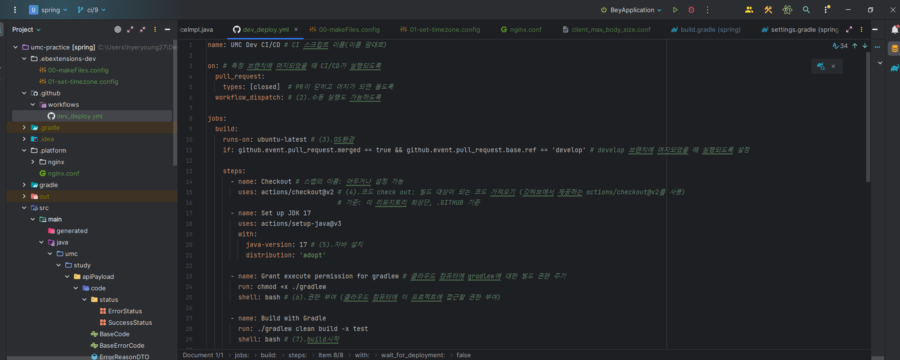
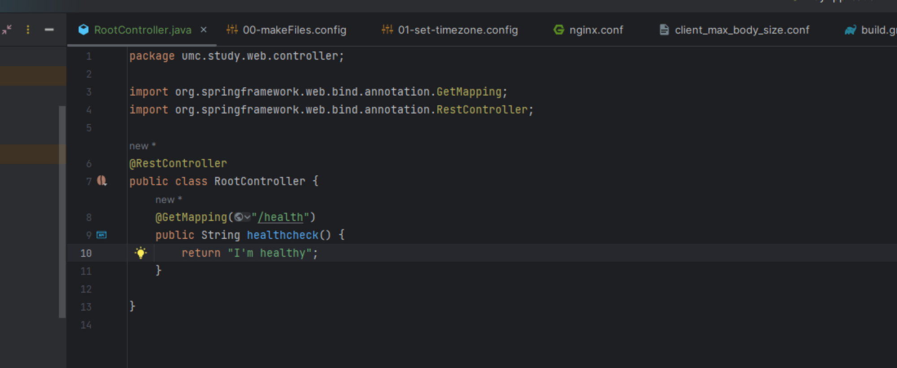
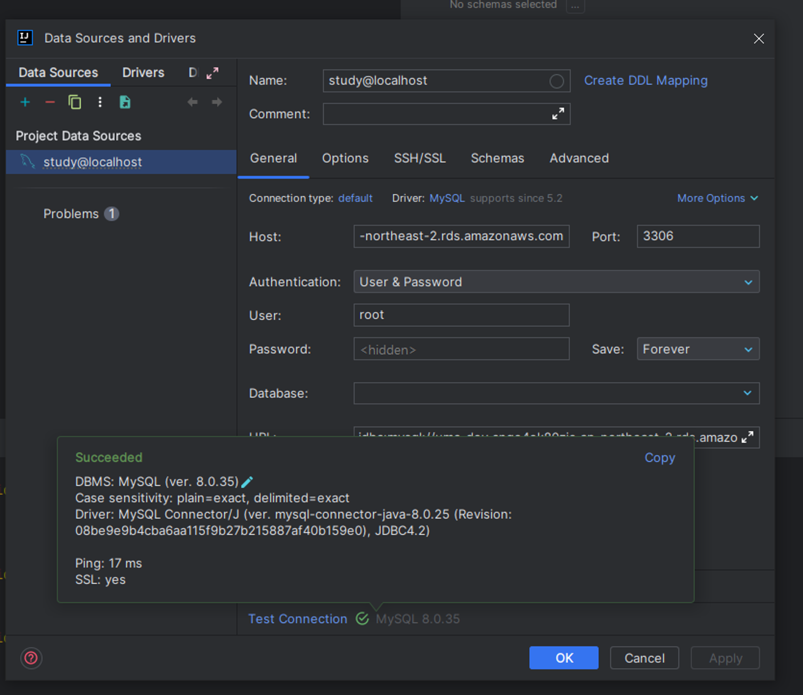
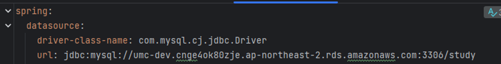
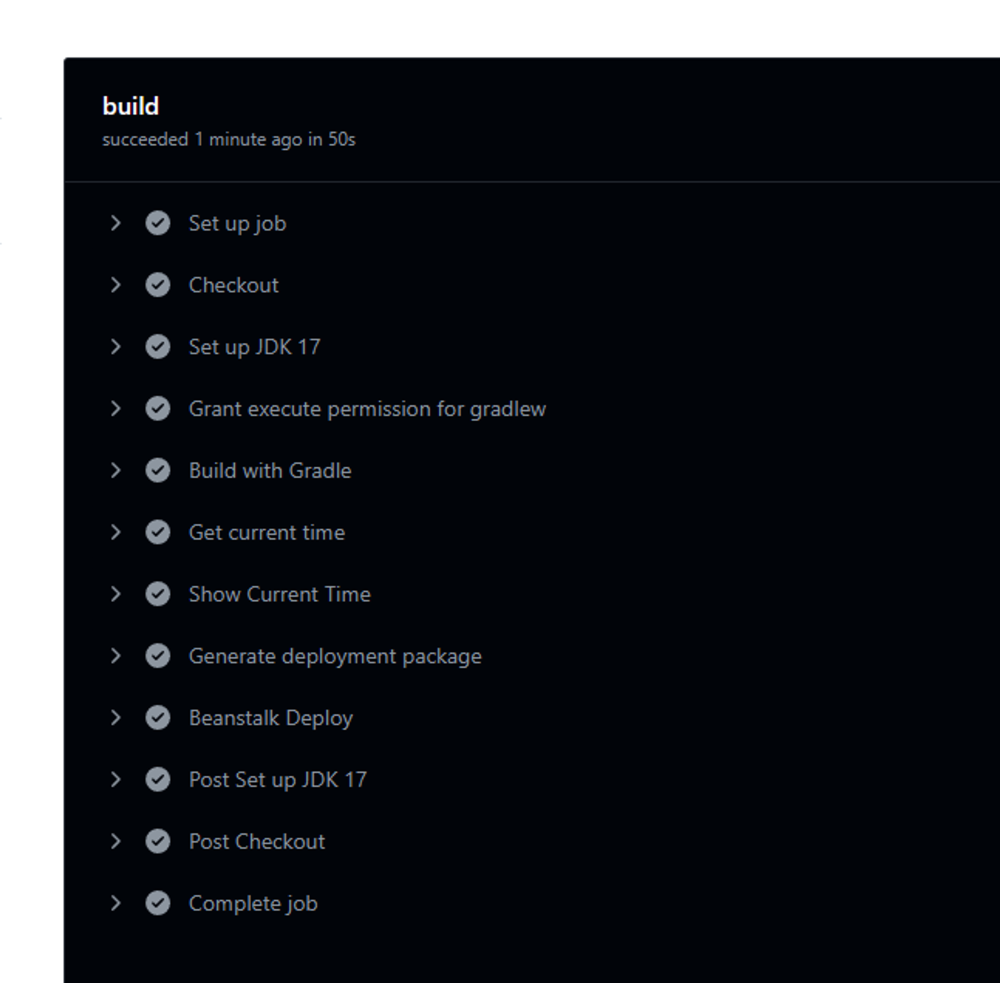
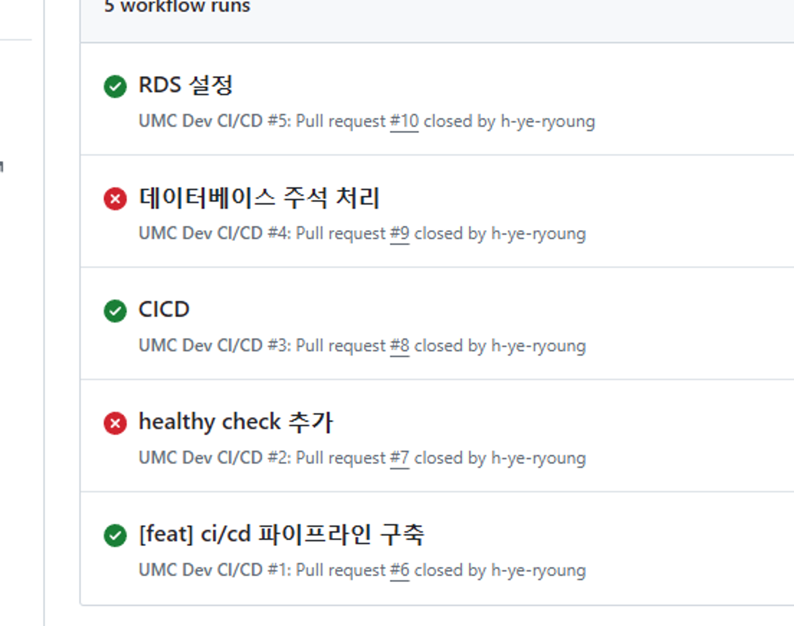
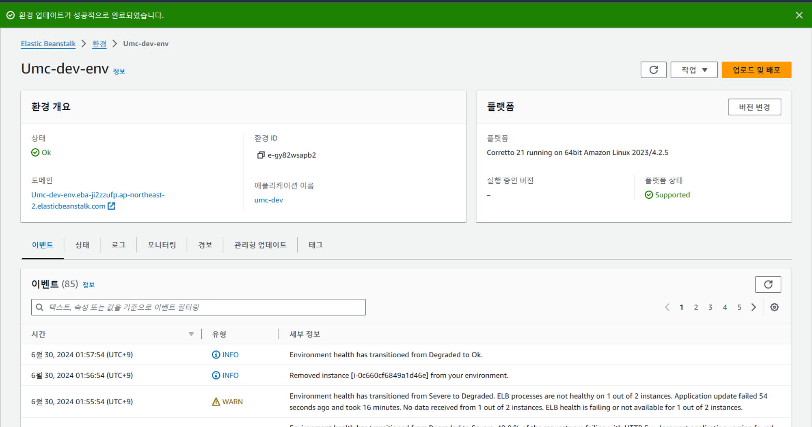

깃허브 주소: https://github.com/h-ye-ryoung/umc-practice/actions

### workflow 설정

### /healthy API

### RDB 커넥션 성공

### application.yml 변경해서 RDS 적용

### RDS 연결해서 develop 브랜치로 Merge에 따른 깃허브 액션성공!

ㅠㅠ

### elastic beanstalk도 완료!
