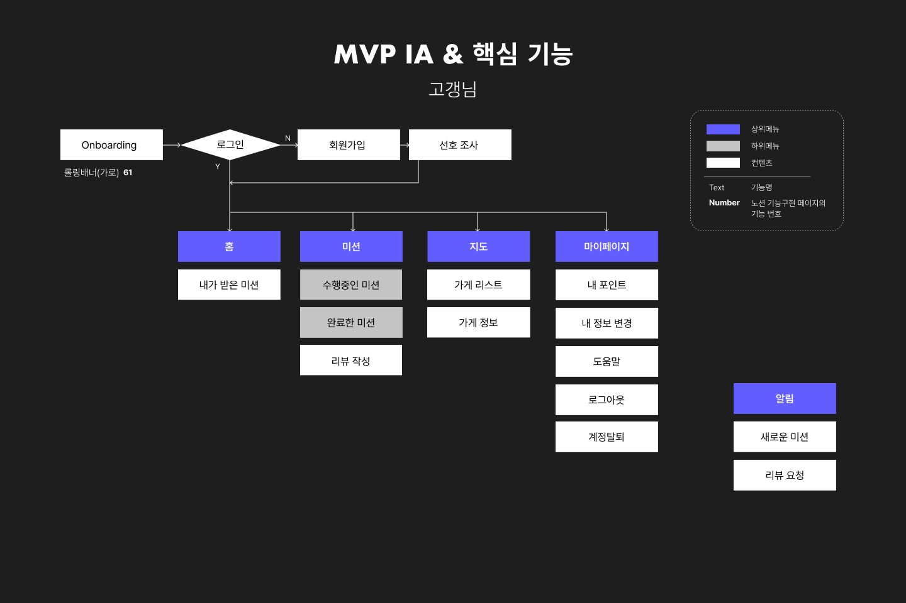
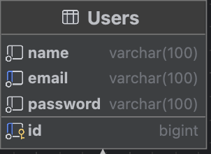
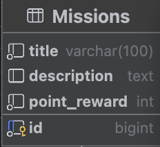
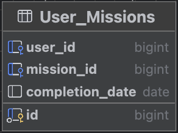
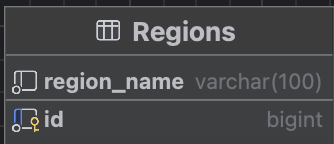
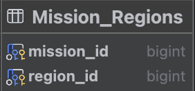
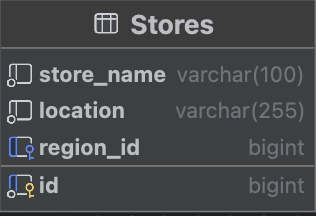
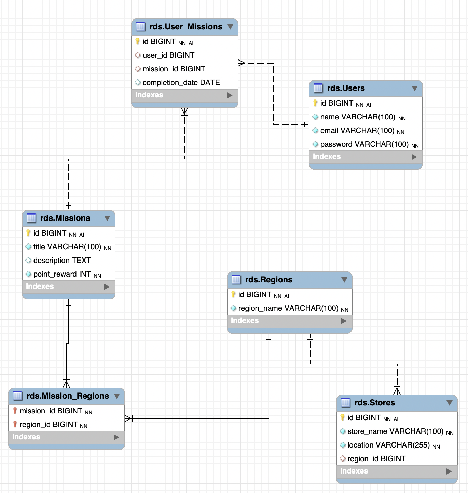
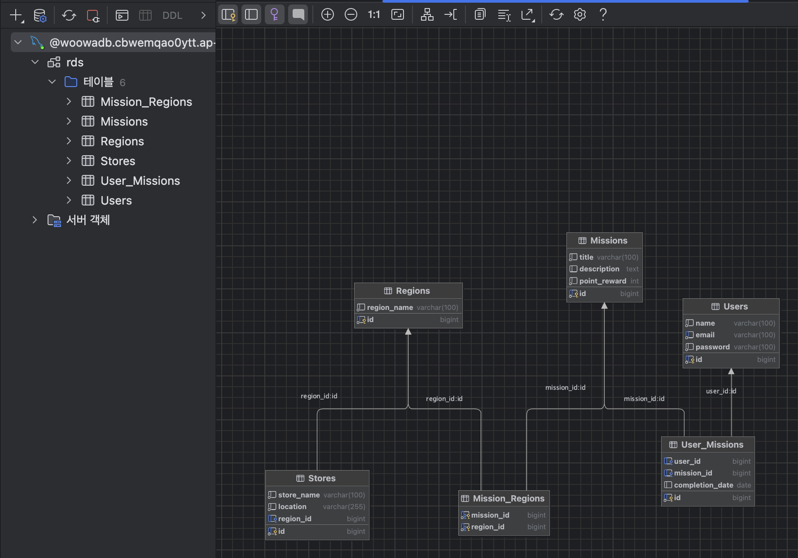

# 미션

1. 주어진 IA(기획 플로우)와 와이어 프레임(디자인 프로토타입)을 보고 직접 데이터베이스를 설계해오기, 위에서 언급한 경우를 다 적용해서 할 것
2. 이름 글자 수 등 세부적인 부분은 원하는 대로 해도 됨!
3. 각 지역 별로 가게들이 있으며 가게를 방문하는 미션을 해결하며 포인트를 모으는 서비스
    1. 모든 지역마다 10개의 미션 클리어시 1000 point 부여로 고정

# 미션 인증

1. Users

2. Missions

3. User_Missions

4. Regions

5. Mission_Regions

6. Stores

- Users-Missions(N:M) 
    - 하나의 유저는 여러 미션을 수행할 수 있다.
    - 하나의 미션은 여러 유저가 수행할 수 있다.

- Stores-Regions(N:1)
    - 하나의 지역에 여러 가게가 포함될 수 있다.

- Regions-Missions(N:M)
    - 하나의 지역에 여러 미션이 포함될 수 있다. 
    - 하나의 미션은 여러 지역에 포함될 수 있다. 
