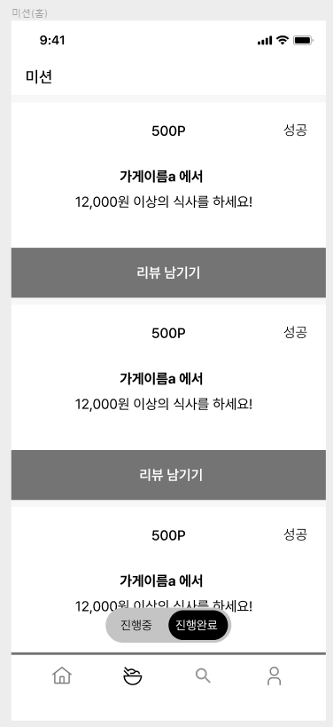
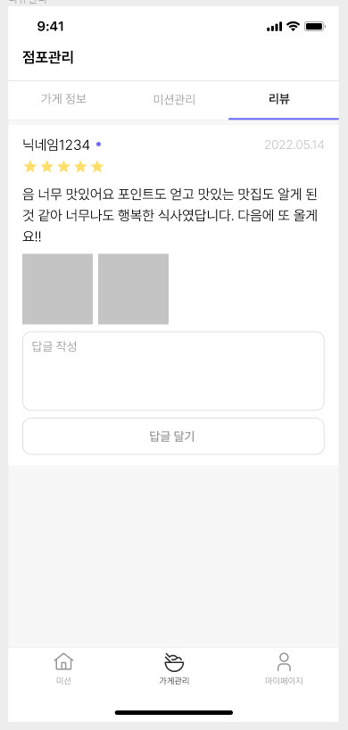
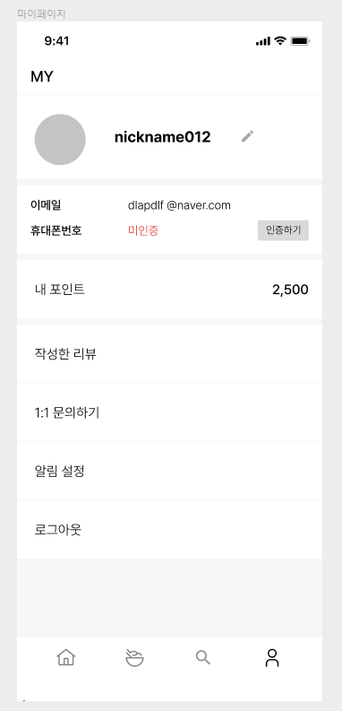

# 5주차 미션 - 쿼리문 작성하기



- 내가 진행중, 진행 완료한 미션 모아서 보는 쿼리(페이징 포함)

## 추출할 정보

- 가게이름: store.name
- 미션 보상: mission.reward
- 미션 소개글: mission.mission_spec
- 미션 상태: member_mission.status

→ 나의 id가 1이라고 가정 (member_mission.member_id = 1)

```sql
SELECT mission.reward, mission.mission_spec, store.name, member_mission.status
FROM member_mission
JOIN mission ON member_mission.mission_id = mission.id
JOIN store ON mission.store_id = store.id
WHERE member_mission.created_at < :last_cursor
AND member_mission.member_id = 1 // 내 아이디가 1이라고 가정
ORDER BY member_mission.created_at DESC // 생성일을 기준으로 내림차순 정렬 (최신순)
LIMIT 10; // 10개씩 페이징 처리
```

---

- 리뷰 작성하는 쿼리, 사진의 경우는 일단 배제

## 추출할 정보

- 닉네임
- 리뷰 글
- 리뷰 점수
- 리뷰 생성일시
- 리뷰 이미지 링크

→ 가게 id가 1이라고 가정 (review.store_id = 1)

```sql
SELECT member.name, review.body, review.score, review.created_at, review_image.image_url
FROM review
JOIN member ON review.member_id = member.id
JOIN review_image ON review.id = review_image.review_id
WHERE review.created_at < :last_cursor
AND review.store_id = 1
ORDER BY review.created_at DESC
LIMIT 10;
```

---

- 홈 화면 쿼리 (현재 선택 된 지역에서 도전이 가능한 미션 목록, 페이징 포함)

## 추출할 정보

- 지역 이름: region.name
- 완료한 미션 개수: complete_cou
- 가게 이름: store.name
- 미션 마감일: mission.deadline
- 미션 정보글: mission.mission_spec
- 미션 보상: mission.reward
- 도전 가능한 미션만 추출: member_mission.status

→ 나의 id가 1이라고 가정(member.id = 1)

```sql
SELECT region.name AS region_name, 
       (SELECT COUNT(*) FROM member_mission WHERE member_id = 1 AND status = 'complete') AS complete_count,
       store.name AS store_name,
       mission.deadline, mission.mission_spec, mission.reward, 
       member_mission.status
FROM member_mission
JOIN mission ON member_mission.mission_id = mission.id
JOIN store ON mission.store_id = store.id
JOIN region ON store.region_id = region.id
JOIN member ON member_mission.member_id = member.id
WHERE member.id = 1
AND mission.created_at < :last_cursor
ORDER BY mission.created_at DESC
LIMIT 10;
```

---


- 마이 페이지 화면 쿼리


## 추출할 정보

- 사용자 이름: member.name
- 사용자 이메일: member.email
- 내 포인트: member.point

→ 나의 id가 1이라고 가정

```sql
SELECT member.name, member.email, member.point
FROM member
WHERE member.id = 1;
```