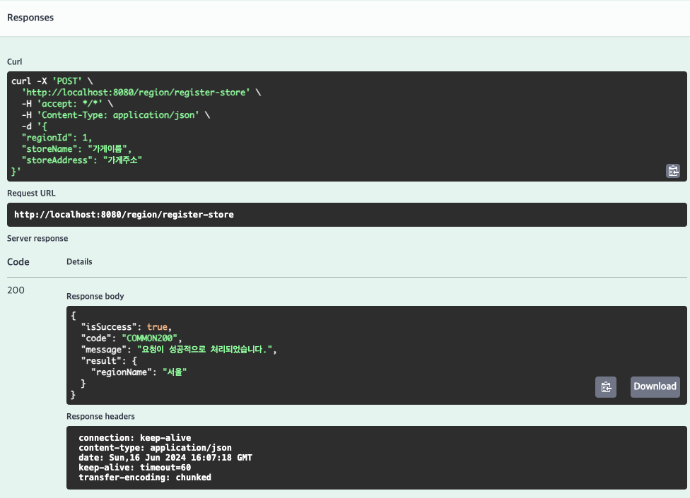
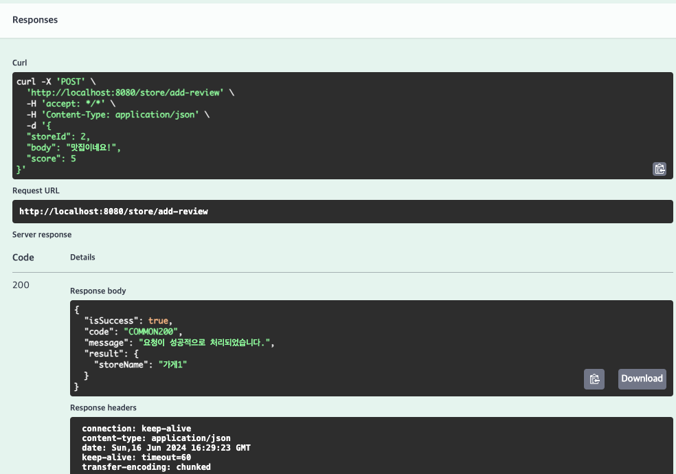
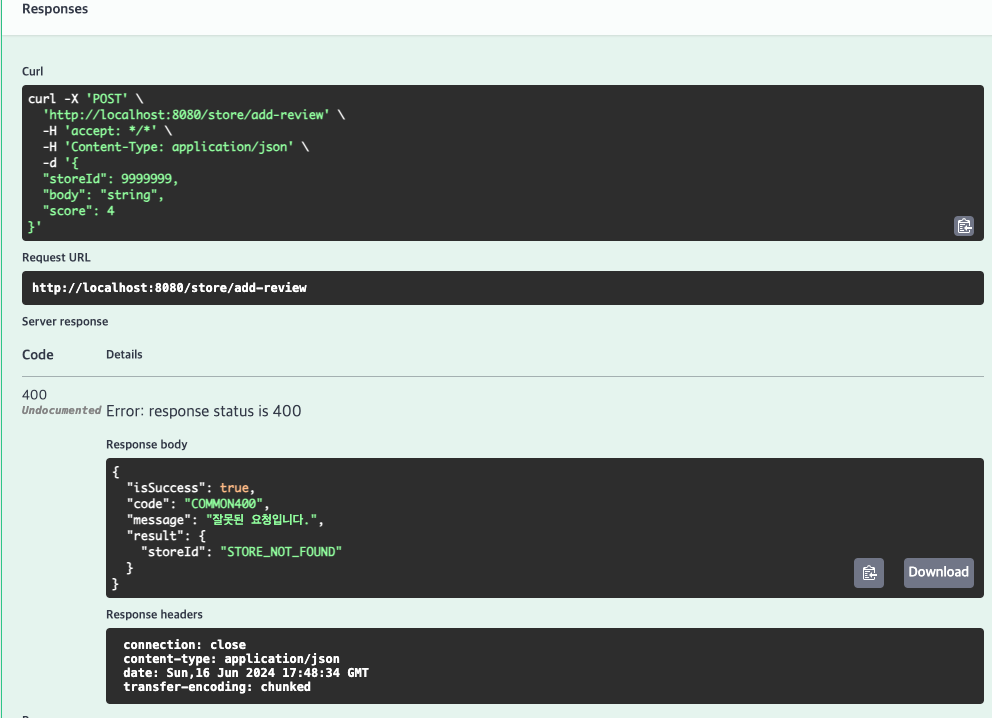
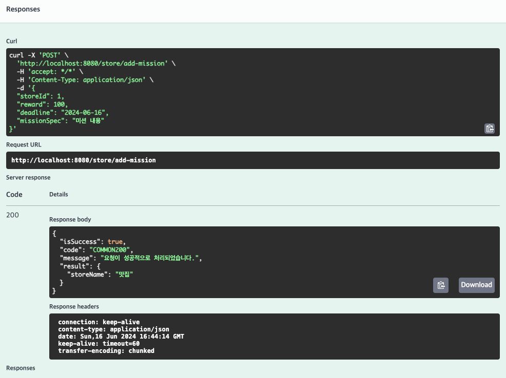
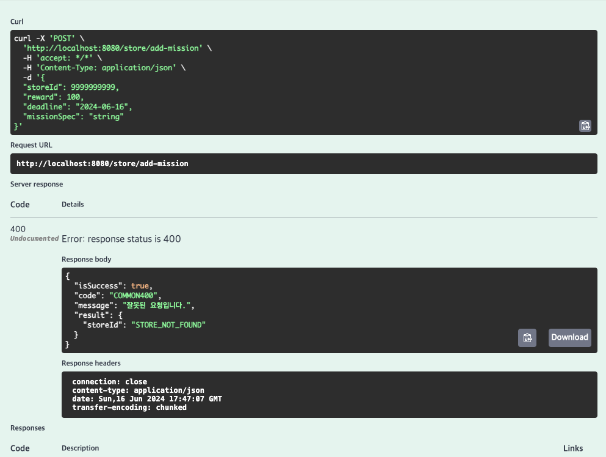
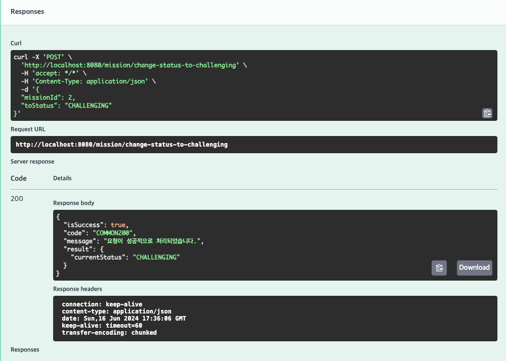
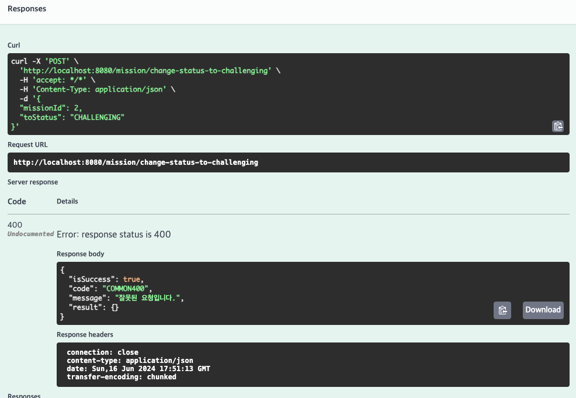

# 9주차 미션

# 1. 특정 지역에 가게 추가하기

→ 지역 아이디, 가게 이름, 가게 주소 받아서 저장

# 2. **가게에 리뷰 추가하기 API**

→ 가게 아이디, 리뷰 글, 별점을 받아서 저장

→ 검증

# 3. 가게에 미션 추가하기 API

→ 가게 아이디, 리워드, 데드라인, 미션스펙 받아서 저장

→ 검증

# 4. **가게의 미션을 도전 중인 미션에 추가(미션 도전하기) API**

→ 미션 아이디, 바꿀 미션 상태를 받아서 저장

→ 검증